# Java后端开发学习路线

## Java后端学习流程图

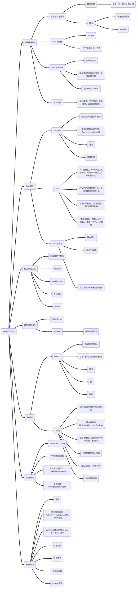

# Java学习

## Java环境搭建

### IntelliJ IDEA安装

1. 官网直接下载**旗舰版**（**试用版**）。

2. 自定义安装只勾选创建桌面快捷方式，其它直接默认next，然后直接install：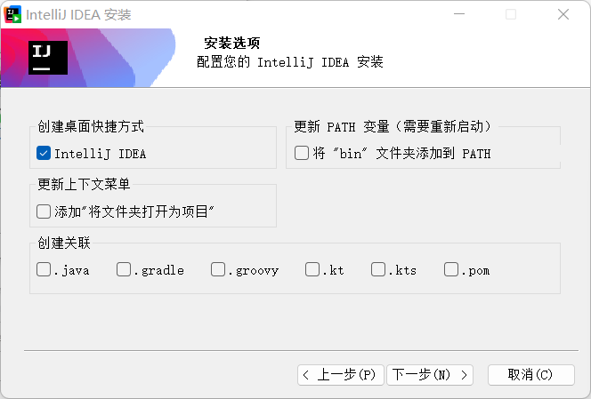

3. 安装好后打开会发现提示输入激活码，直接先关闭应用，下载激活工具并激活，教程见：[bilibili某贴](https://www.bilibili.com/read/cv34286633/)，亲测2023的工具能用于24的最新版IDEA

## IDEA配置

### Hello World

1. 打开IDEA，新建项目，注意选择新建**空项目**，有git的话可以新建一个git仓库：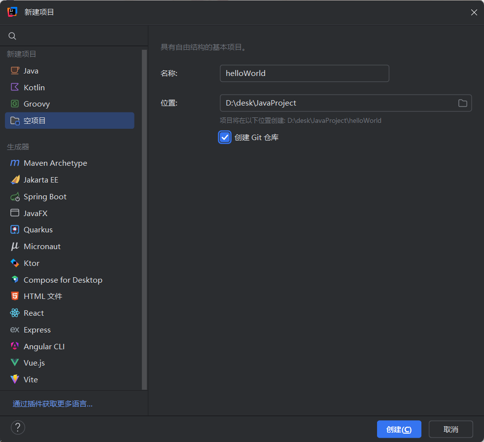

2. 进入项目，打开文件，新建Java模块，在JDK一栏选择下载17.0.13，自定义目录，安装JDK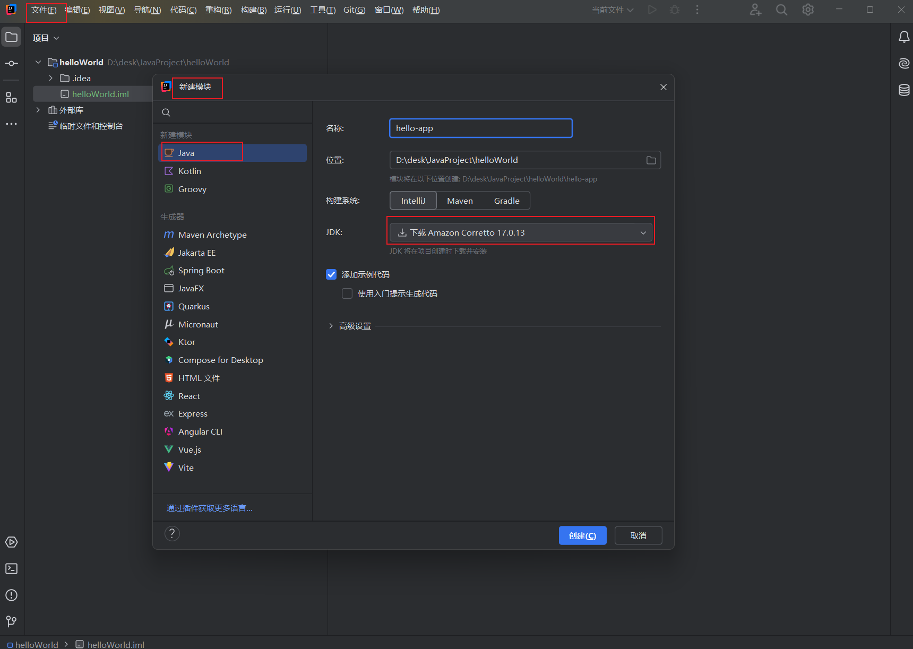

3. 在src中右键，新建包：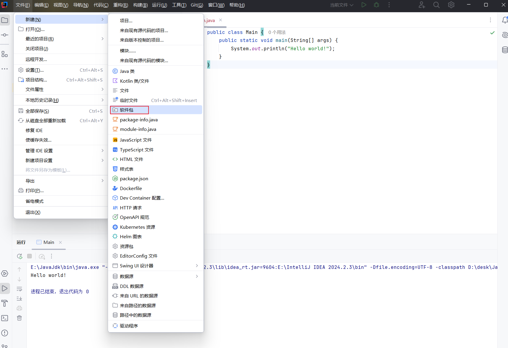

4. 然后在包中右键新建java类，代码中输入main回车快捷添加架子，再输入sout回车快捷添加输出语句：

   ```java
   public class hello {
       public static void main(String[] args) {
           System.out.println("hello");
       }
   }
   ```

5. 最后编译并运行，可以看到成功输出helloworld，生成文件保存在项目中的**out目录**下。

### 快捷键推荐

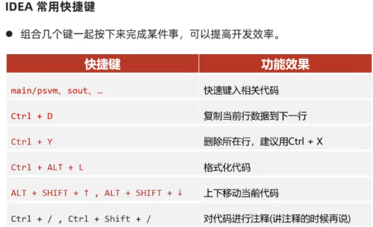

## 相关知识（遇到不懂的知识点看这里）

### JDK的组成

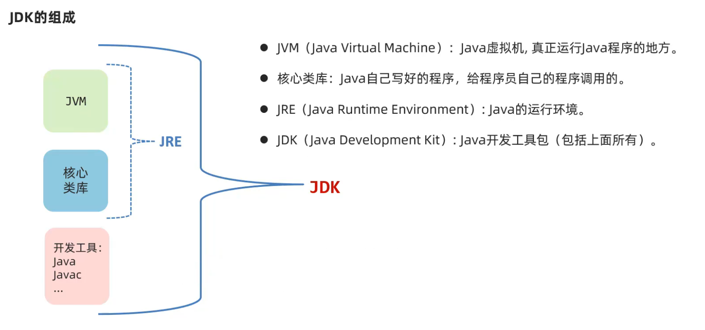

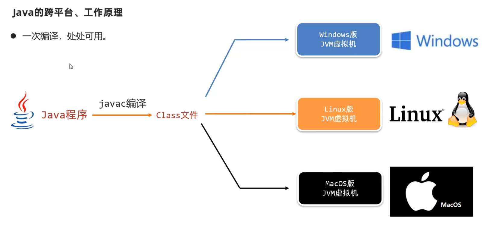

### IDEA管理Java程序的结构

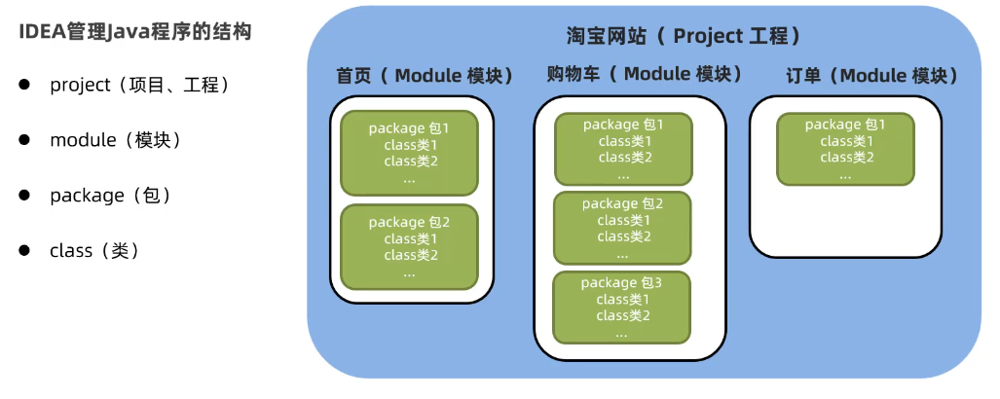

### 数据类型

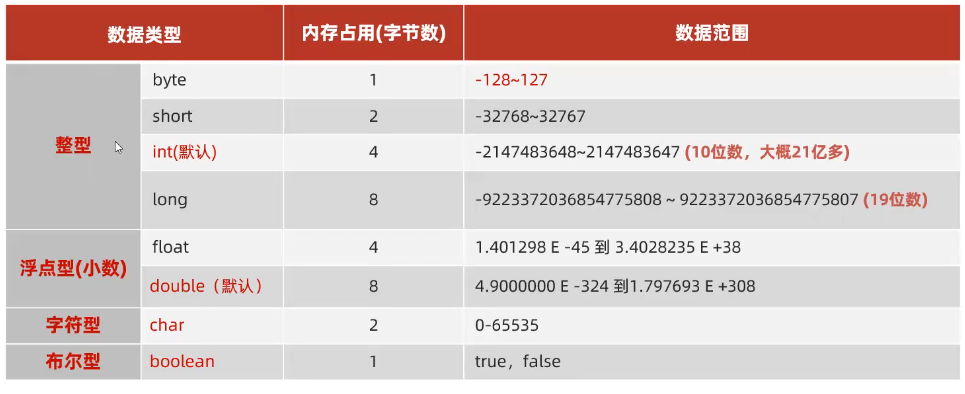

# Java语言学习

## Java Scanner类

java.util.Scanner 是 Java5 的新特征，我们可以可以通过 Scanner 类来获取用户的输入。

```java
Scanner s = new Scanner(System.in);
```

通过 Scanner 类的 next() 与 nextLine() 方法获取输入的字符串:

```java
 String str1 = scan.next();
 String str2 = scan.nextLine();
```

### next() 与 nextLine() 区别

next():

- 1、一定要读取到有效字符后才可以结束输入。
- 2、对输入有效字符之前遇到的空白，next() 方法会自动将其去掉。
- 3、只有输入有效字符后才将其后面输入的空白作为分隔符或者结束符。
- next() 不能得到带有空格的字符串。

nextLine()：

- 1、以Enter为结束符,也就是说 nextLine()方法返回的是输入回车之前的所有字符。
- 2、可以获得空白。

## 数组

### 数组初始化

#### 静态初始化

```java
//标准写法
int[] array=new int[]{1,2,3};
//简化
int[] array={1,2,3};

//二维数组
//标准写法
int[][] array=new int[][]{{1,2},{3,4}};
//简化
int[] array={{1,2},{3,4}};
```

#### 动态初始化

```java
//整数默认初始化0
//小数初始化0.0
//字符初始化'/u0000'空格
//布尔初始化false
//引用初始化null
int[] arr=new int[3];

//二维数组
int[][] arr=new int[2][2];
```

## 字符串

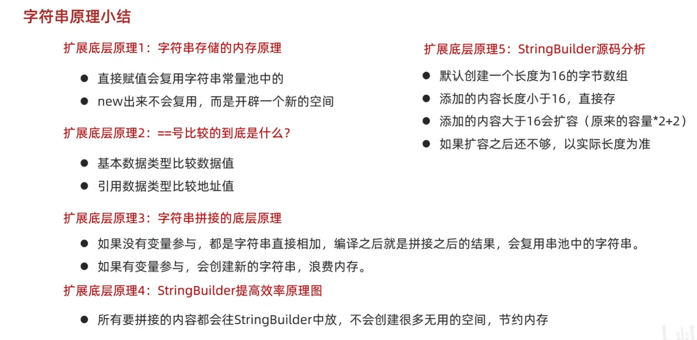

## 集合

### 初始化

```java
ArrayList<String> list= new ArrayList<>();
```

### 增删改查

```java
list.add("aaa");
list.remove("aaa");
list.set(0,"ddd");//修改第0号元素
list.get(0)
```


## 方法

### 重载

要求：同一个类，方法名一样，传参类型或数量不一样。

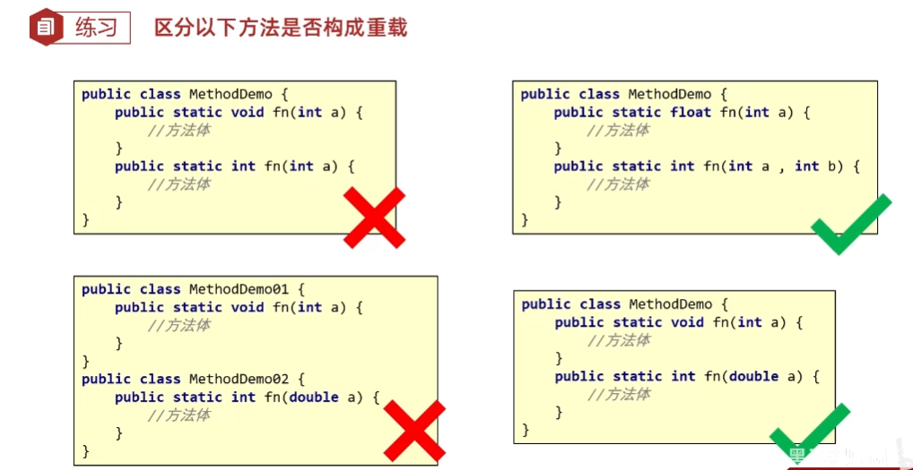

## 面向对象

### 继承

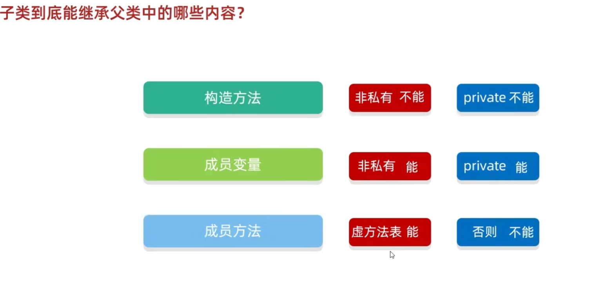

#### 权限修饰符

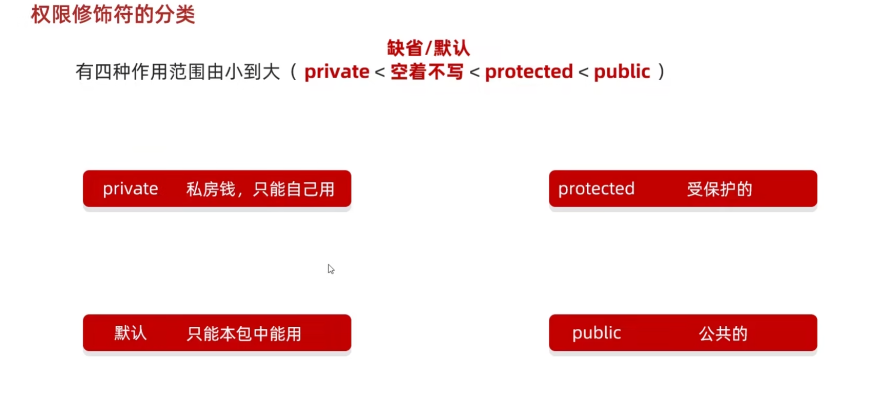

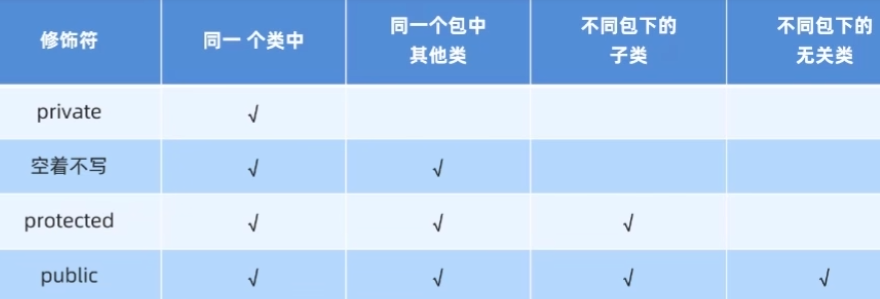

#### 重写

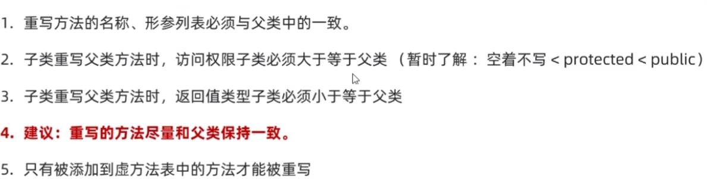

##### 抽象类


##### 接口

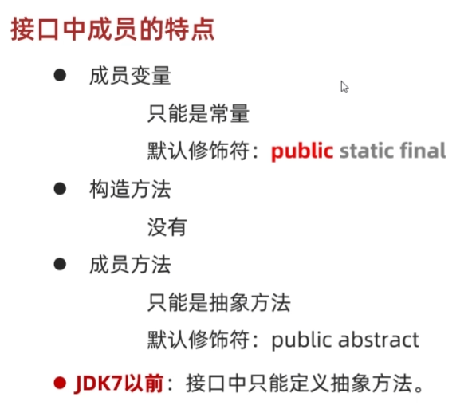

### 多态

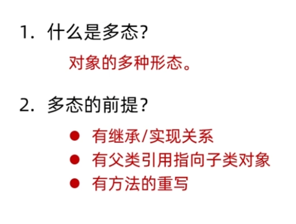
