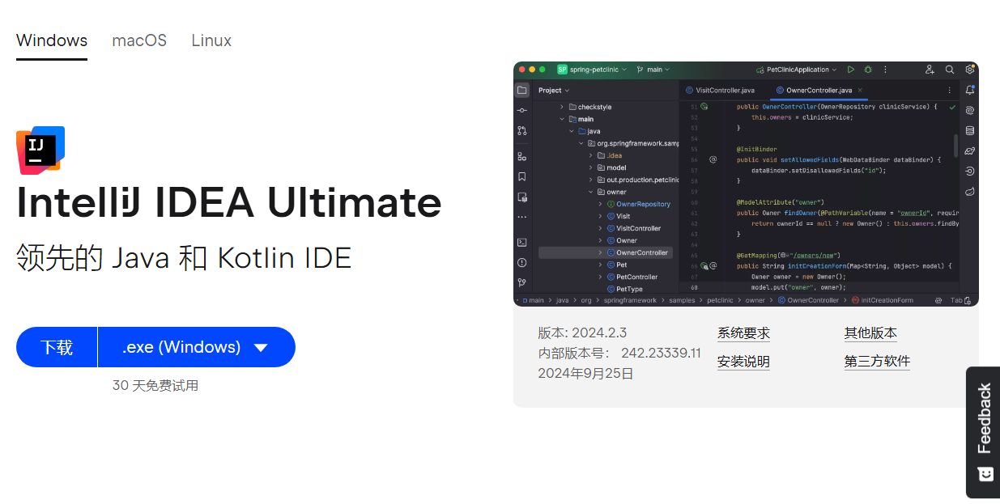

# Java后端开发学习路线

## Java后端学习流程图


# Java学习

## Java环境搭建

### IntelliJ IDEA安装

1. 官网直接下载**旗舰版**（**试用版**）。

2. 自定义安装只勾选创建桌面快捷方式，其它直接默认next，然后直接install：

3. 安装好后打开会发现提示输入激活码，直接先关闭应用，下载激活工具并激活，教程见：[bilibili某贴](https://www.bilibili.com/read/cv34286633/)，亲测2023的工具能用于24的最新版IDEA

## IDEA配置

### Hello World

1. 打开IDEA，新建项目，注意选择新建**空项目**，有git的话可以新建一个git仓库：

2. 进入项目，打开文件，新建Java模块，在JDK一栏选择下载17.0.13，自定义目录，安装JDK

3. 在src中右键，新建包：

4. 然后在包中右键新建java类，代码中输入main回车快捷添加架子，再输入sout回车快捷添加输出语句：

   ```java
   public class hello {
       public static void main(String[] args) {
           System.out.println("hello");
       }
   }
   ```

5. 最后编译并运行，可以看到成功输出helloworld，生成文件保存在项目中的**out目录**下。

### 快捷键推荐


## 相关知识（遇到不懂的知识点看这里）

### JDK的组成


### IDEA管理Java程序的结构


### 数据类型


