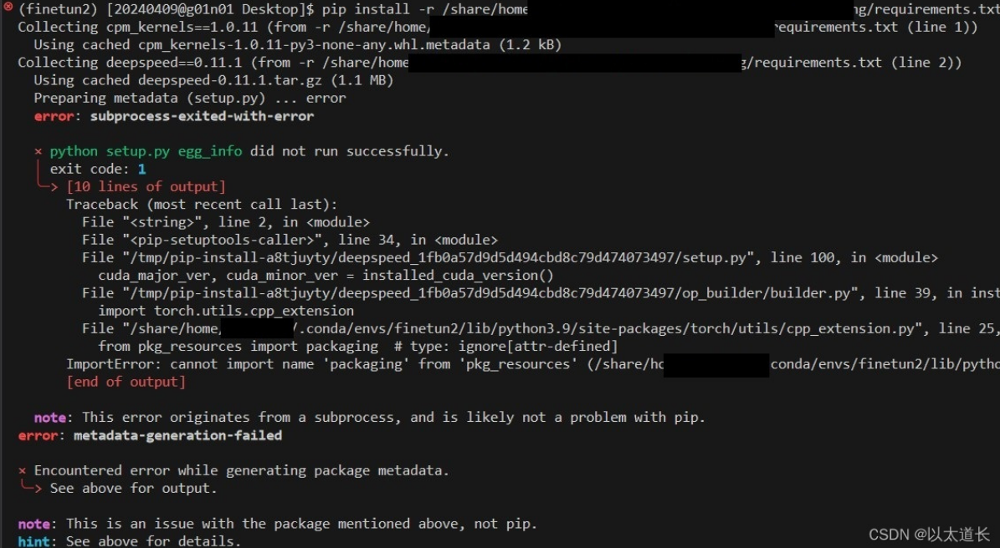

# conda环境配置踩坑

首先默认在咱实验室环境下跑，那么每句消耗流量的命令前默认添加：

```b
proxychains
```

## conda装环境

首先创建环境

```bash
conda create -n envName python=3.9
```

然后可以看一下有哪些环境

```bash
conda env list
```

然后激活环境

```bash
conda activate envName
```

然后把默认进base给禁了

```bash
conda config --set auto_activate_base false
```

### conda install 的坑

直接使用conda install 时可能会出现网络问题，因此先添加源：

```bash
#清华源
conda config --add channels https://mirrors.tuna.tsinghua.edu.cn/anaconda/pkgs/free/
conda config --add channels https://mirrors.tuna.tsinghua.edu.cn/anaconda/pkgs/main/
conda config --add channels https://mirrors.tuna.tsinghua.edu.cn/anaconda/cloud/conda-forge/
#中科大源
conda config --add channels https://mirrors.ustc.edu.cn/anaconda/pkgs/main/
conda config --add channels https://mirrors.ustc.edu.cn/anaconda/pkgs/free/
conda config --add channels https://mirrors.ustc.edu.cn/anaconda/cloud/conda-forge/
conda config --add channels https://mirrors.ustc.edu.cn/anaconda/cloud/msys2/
conda config --add channels https://mirrors.ustc.edu.cn/anaconda/cloud/bioconda/
conda config --add channels https://mirrors.ustc.edu.cn/anaconda/cloud/menpo/
#设置搜索时显示通道地址
conda config --set show_channel_urls yes
```

#### conda 换源后依然出现网络问题，或安装不上

安装不上可能是因为conda源中没有需要的指定版本的库，首先考虑用pip安装

#### conda 安装成功

安装好后检查是否安装成功，一般这一步都没问题了

```bash
conda list
```

#### conda删除环境

```bash
conda remove --name ENV_NAME --all 
```

#### pip 相关网络问题

首先pip安装过程中出现网络问题，一样的换源（单次）

```bash
pip install -i https://pypi.tuna.tsinghua.edu.cn/simple packageYouNeed 
```

#### pip其它问题

pip安装时发现装的特别快，此时用conda list 发现环境库中不存在该库，用pip list却在，此时发现pip list 和conda list显示内容不一样。

##### 原因一

查看pip所在目录，发现位置不对（指向公用的pip路径）

```bash
#查看pip所在目录
which pip
```

这是因为没进入conda环境

```bash
conda activate envName
```

##### 原因二

查看pip所在目录，发现位置正确

```
#conda中pip大致路径如下
/home/xhe/.conda/envs/project/bin/python
```

但是pip install 还是会安装在别的目录下（原因未知），这时只能指定pip安装路径。

首先查看conda环境下的库所在位置：

```
import module
print(module.__file__)
```

然后pip install指定路径：

```
pip install package_name --target /path/to/your/directory
```

完整命令例：

```bash
proxychains pip install -i https://pypi.tuna.tsinghua.edu.cn/simple transformers  --target /home/xhe/.conda/envs/project/lib/python3.9/site-packages
```

#### pip安装问题

1. 报错：当你使用 pip install 安装某个 Python 包时，如果 setuptools 版本过高或过低，可能会导致安装过程出错，并出现类似以下错误信息：`error: subprocess-exited-with-error`直接重新安装合适版本的setuptools即可。例如，针对上面的报错，pip中setuptools的版本是70.0.0，将它降低版本就pip安装新的库就成功了。

   ```bash
   pip uninstall setuptools
   pip install setuptools==69.0.0
   pip install <your-package>
   ```

   

