# git 相关

## git 安装及配置步骤

### git安装

1. [git下载地址](https://git-scm.com/downloads)

2. 安装时注意修改默认安装路径，其它直接next即可，下载后打开电脑高级系统设置，环境变量，系统变量，添加PATH。


3. 打开cmd，输入"git --version"，出现版本信息则安装成功。

   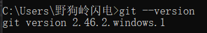

### git配置

1. 打开cmd，输入命令查看有没有历史注册信息：

   ```
   查看用户名 ：git config user.name
   
   查看密码： git config user.password
   
   查看邮箱：git config user.email
   
   查看配置信息： $ git config --list  
   ```

   没有则进行配置：

   ```
   修改用户名
   git config --global user.name "xxxx(新的用户名)"
   
   修改密码
   git config --global user.password "xxxx(新的密码)"
   
   修改邮箱
   git config --global user.email "xxxx@xxx.com(新的邮箱)"
   ```

   若报错则说明用户名过多，尝试修改：

   ```
   解决办法：$ git config --global --replace-all user.name "你的 git 的名称"
   
   　　　　　$ git config --global --replace-all uesr.email "你的 git 的邮箱
   ```

2. 在cmd中cd进入想进行git管理的文件夹中，输入"git init"初始化，可以看见文件夹中出现.git文件夹，说明初始化成功。

   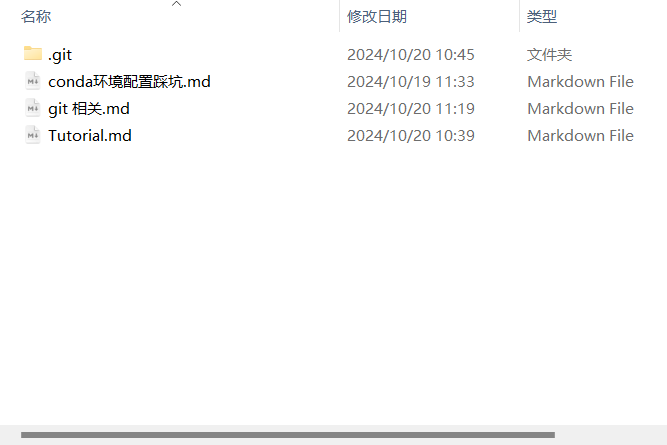

3. 输入git status可以查看当前git**本地**仓库信息：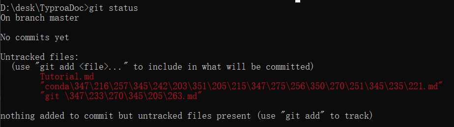

## git简单使用

1. 输入"git add ."将当前目录下所有项目添加到**本地**仓库，输入"git commit"，将项目进行提交。此时输入`git branch`会发现新建了一个本地分支master

   ```
   将当前目录下所有项目添加到**本地**仓库,"."表示全部
   git add . 
   将项目提交,-m 后面引号里面是本次提交的注释内容，必须写，不然会报错
   git commit -m "firstCommit"
   ```

   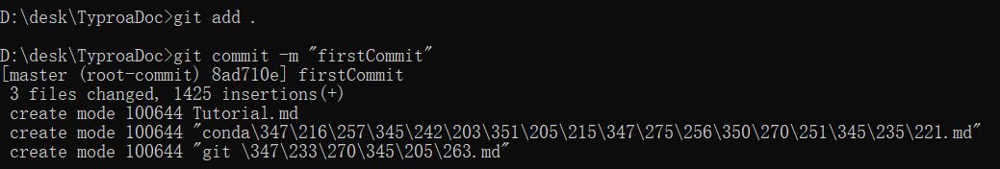

2. 关于add或commit的回退操作：

   ```
   查看提交历史：
   查看所有提交：
   git log
   查看提交时的改动，-2显示最近的两次提交：
   git log -p -2
   查看每次提交的简略改动：
   git log --stat
   
   撤销操作：
   漏掉了几个文件没有添加，或者提交信息写错了，补充上次提交：
   git commit --amend
   取消暂存(add)的文件：
   git reset HEAD 
   将文件还原成上次提交的样子：
   git checkout
   
   回退版本：
   回退上一个版本：
   git reset --hard HEAD^
   回退上两个版本：
   git reset --hard HEAD^^
   回退到指定版本（版本号用git reflog查看）：
   git reset --hard 版本号
   ```

   

2. 创建github账号，为本次项目新建一个仓库（repository）:

   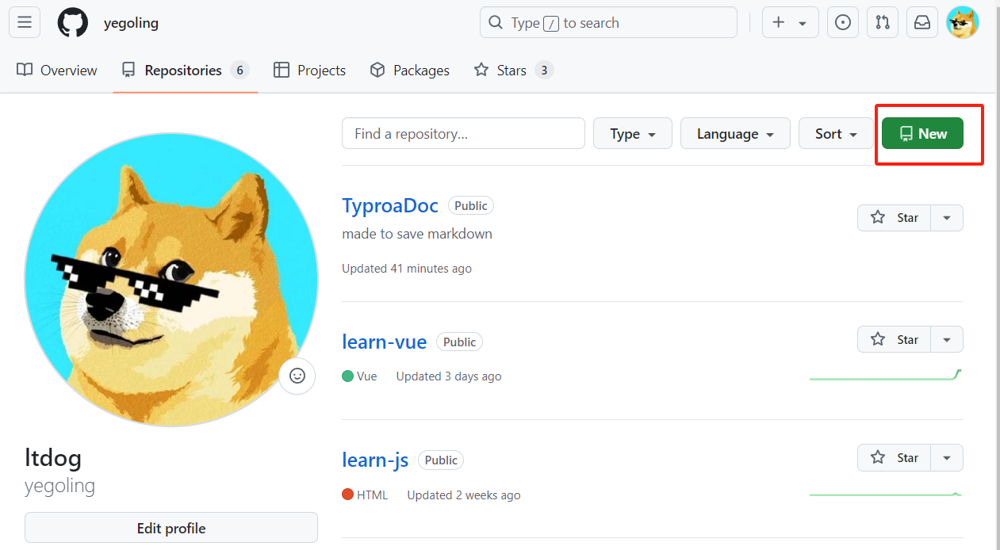

   创建好之后复制仓库的http链接：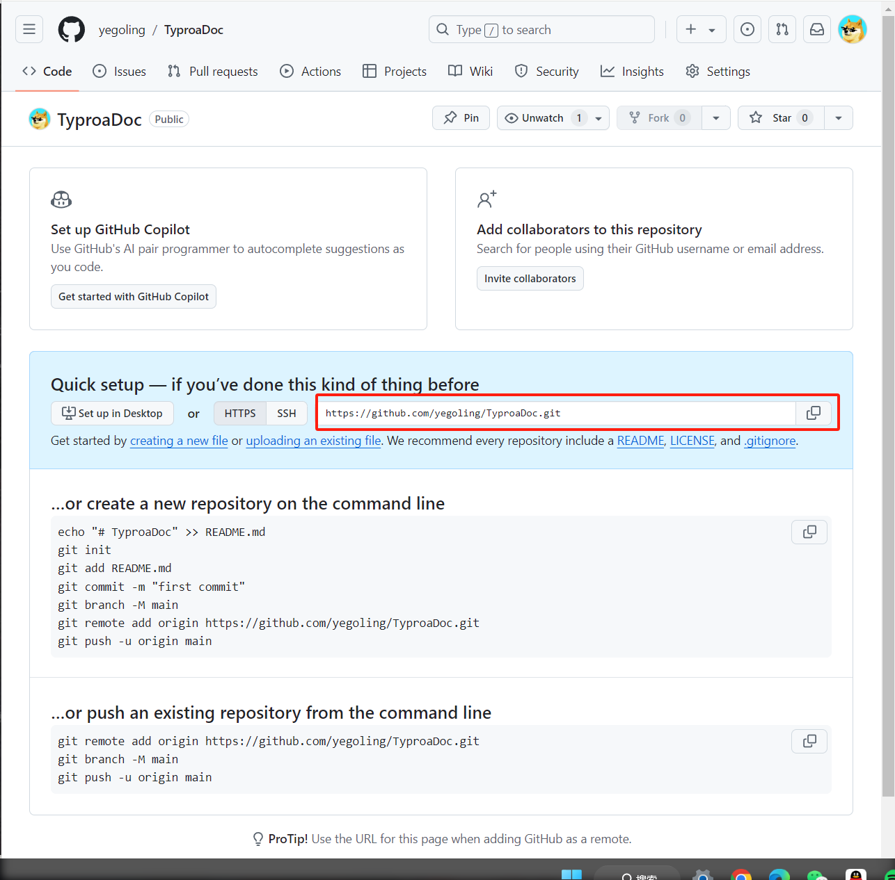

   在cmd中输入指令添加远程仓库：

   ```
   git remote add origin https://github.com/yegoling/TyproaDoc.git
   ```

   然后查看远程仓库配置：

   ```
   git remote -v
   ```

   可以看到已经配置成功。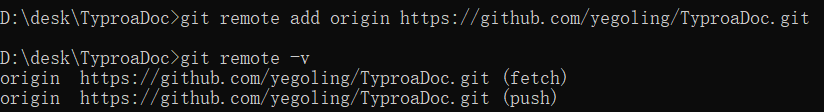

   需要注意这里的远程URL仓库只对本项目有效（即输入"git init"时所在的目录），对不同的项目则需要重新配置。
   
3. 最后将commit到**本地**仓库的项目push到**远程**仓库去（注意，当你输入 `git push` 命令时，它默认会将代码推送到你当前分支所关联的远程仓库）：

   ```
   git push
   ```

   这里报错了，意思是：当前分支没有与远程分支关联，因此导致了提交代码失败。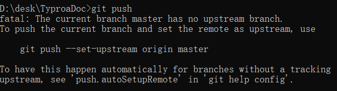

   查看本地分支与远程分支：

   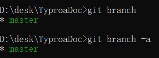

   ```
   解决方法1，暴力push到指定仓库分支。
   git push origin master
   解决方法2，先把本地分支push到指定分支中，然后再建立本地分支与该分支的关联。好处是以后就不用再指定分支，可以直接输入git push。
   git push --set-upstream origin master
   
   注意这里的origin指的是git remote -v查看的远程仓库名，master指的是本地分支名
   ```
   
   出现报错：
   
   ```bash
   fatal: unable to access 'https://github.com/yegoling/mindnlp.git/': OpenSSL SSL_read: SSL_ERROR_SYSCALL, errno 0
   ```
   
   解决方法：
   
   ```
   git config --global --unset http.proxy 
   git config --global --unset https.proxy
   
   这里的7890是vpn端口号（在clash上查看）
   git config --global http.proxy 127.0.0.1:7890
   git config --global https.proxy 127.0.0.1:7890
   ```
   
   可以看到github仓库已经更新：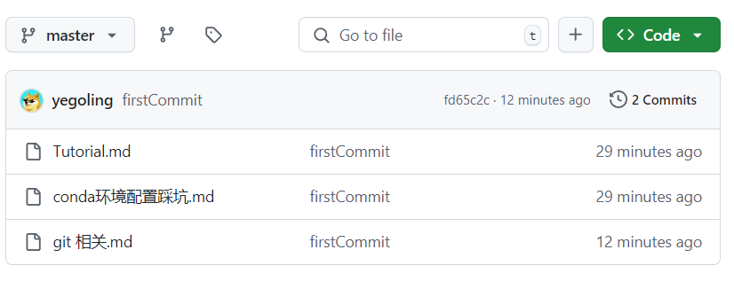

## git协同开发

### 通过git branch协同开发

   1. 创建新分支：
   
      ```
      git branch newBranch
      ```
   
   2. 切换分支：
   
      ```
      git switch newBranch
      ```
   
   3. 在newBranch分支下进行开发，开发完成并提交后回到主分支：
   
      ```
      git switch master
      ```
   
   4. 合并分支：
   
      ```
      git merge newBranch
      ```
   
   5. 删除分支：
   
      ```
      1.合并完成后删除分支：
      git branch -d newBranch
      2.没合并时想删除分支，使用强制删除命令：
      git branch -D newBranch
      ```


### 通过git fork协同开发

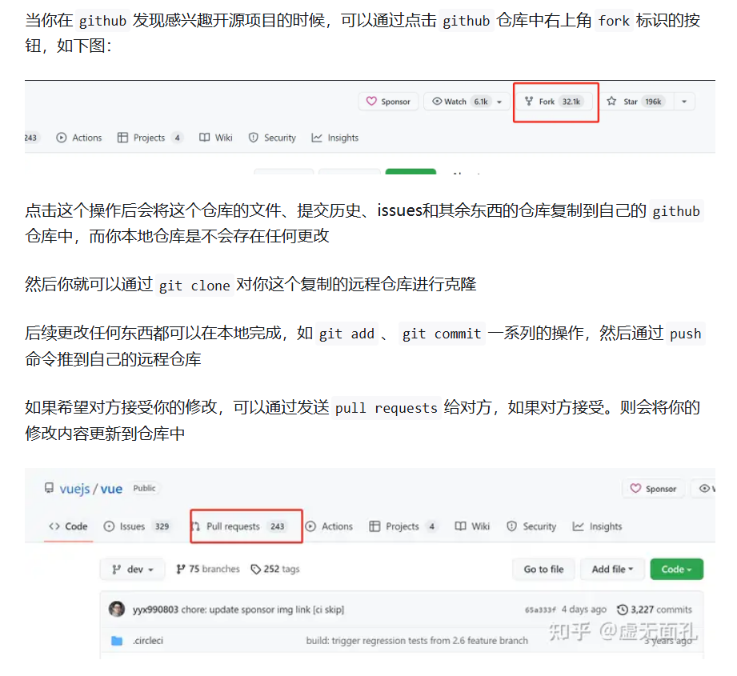

提交时需要先添加上游源（fork的源地址）：

```
git remote add upstream https://github.com/mindspore-lab/mindnlp.git
```

   然后`git remote -v`查看：

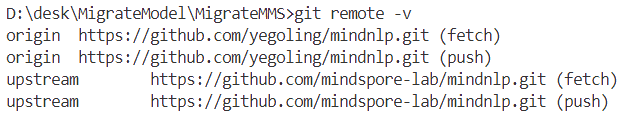

1. 从上游仓库 fetch 分支和提交点，传送到本地，并会被存储在一个远程分支 *upstream/master*：

   ```
   git fetch upstream 
   ```

   查看分支：

   ```
   查看所有分支：
   git branch -a
   查看远程分支：
   git branch -r
   查看本地分支：
   git branch
   ```

   切换到本地主分支：

   ```
   git switch master
   ```

   把 upstream/master 分支合并到本地 master 上，这样就完成了同步，并且不会丢掉本地修改的内容。

   ```
   git merge upstream/master --allow-unrelated-histories
   ```

   这里报了一个很奇怪的错，没有解决，因此只能采用别的方法。。。

2. （针对上一种方法没解决采用的新方法）创建本地分支来跟踪远程分支：

   ```
   git checkout -b local-upstream-branch-name upstream/remote-branch-name
   ```
   
   依旧报相同错误，输入：
   
   ```
   git checkout -f -b local-upstream-branch-name upstream/remote-branch-name
   ```

## git ssh配置

1. cmd输入命令生成ssh秘钥

   ```
   ssh-keygen -t rsa -C "your email"
   ```

2. cd进入.ssh目录下，复制内容:

   ```
   cd C:\Users\野狗岭闪电\.ssh
   type id_rsa.pub
   ```

3. 粘贴进去github ssh栏即可
