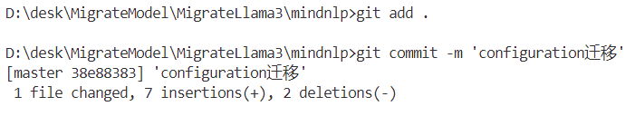

# MindSporeNLP套件-模型迁移任务

## 模型迁移教程


### Configuration迁移


### Tokenizer迁移

1. 找到Transformers的源码

   ```
   /transformers/src/transformers/models/tokenization_yourModel.py
   /transformers/src/transformers/models/tokenization_yourModel_fast.py
   ```

2. 找到mindnlp源码

   ```
   /mindnlp/mindnlp/transformers/models/yourModel/tokenization_yourModel.py
   /mindnlp/mindnlp/transformers/models/yourModel/tokenization_yourModel_fast.py
   ```

3. 修改tokenization_yourModel.py和tokenization_yourModel_fast.py

   tokenization_yourModel.py改之前：改之后：

   tokenization_yourModel_fast.py改之前：

   

   改之后：

### Model迁移 

#### import replace

xxxxxxxxxx from mindnlp.transformers import VitsModel, AutoTokenizerimport mindsporemodel = VitsModel.from_pretrained("./mms-tts-eng")tokenizer = AutoTokenizer.from_pretrained("./mms-tts-eng")​text = "some example text in the English language"inputs = tokenizer(text, return_tensors='ms')print(inputs)output = model(**inputs).waveformpython 

#### global replace


#### Cell attribute


#### api mapping


#### _init_weights


#### remove useless docs


### Unit Tests

test**大致**目录:

```
huggingface/transformers/src/test/model/yourModel/test
```


## 模型迁移实践

### 模型迁移前的准备

1. 在github上找到mindnlp项目并fork:

2. 在本地新建项目目录，在项目目录中打开终端，输入`git init`初始化git，再输入`git clone`加fork到自己的远程仓库的mindnlp链接，将mindnlp项目clone到本地：

   ```
   git clone https://github.com/yourName/mindnlp.git
   ```

3. 在vscode中打开本地的mindnlp项目，即可开始实践。

### MiniCPM-Llama3模型迁移

#### 文件下载

1. huggingface上找到模型文件

2. 将py文件下载在本地，并找到mindnlp/transformers/models目录，新建minicpm_llama3目录，将py文件粘贴在该目录下：

   

3. 为了保险进行第一次`git commit`：

#### Configuration迁移

1. 修改`from transformers.utils import logging`为`from mindnlp.utils import logging`
2. 没有ONNX可以去掉
3. 添加`_all_`：
4. 为了保险进行第二次`git commit`:

#### Tokenizer迁移

好像没有任何能改的地方

#### Model迁移

##### modeling_minicpmv.py

1. 严格匹配torch，全局替换为mindspore:
2. 全局替换transformers为mindnlp
3. long换为int64
4. 去掉utils前的nn
5. 把.zeros和.arrange前的torch改为ops
6. 删掉所有device相关代码
7. torchvision相关更改
8. git commit

##### image_processing_minicpmv.py

1. 替换所有torch为mindspore
2. 全局替换transformers为mindnlp，发现有报错是因为有两个同名的transformers目录，替换mindnlp为transformers
3. 去掉所有的device相关代码
4. 在utils/generic.py中添加函数
5. nn.function改为ops
6. .size()改为.shape()
7. git commit

##### processing_minicpmv.py

1. torch相关函数逐一修改
2. git commit

##### resampler.py

1. torch相关函数逐一修改，nn.function改为ops
2. from torch.nn.init import trunc_normal_改为from mindspore.common.initializer import TruncatedNormal
3.  删除所有device相关代码
4. git commit

#### Unit Tests


### MMS模型迁移

#### 文件下载

#### Configuration迁移

#### Tokenizer迁移

#### Model迁移

#### Unit Tests