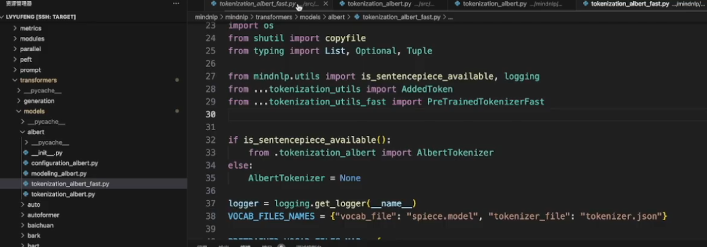

# MindSporeNLP套件-模型迁移任务

## 模型迁移教程


### Configuration迁移


### Tokenizer迁移

1. 找到Transformers的源码

   ```
   /transformers/src/transformers/models/tokenization_yourModel.py
   /transformers/src/transformers/models/tokenization_yourModel_fast.py
   ```

2. 找到mindnlp源码

   ```
   /mindnlp/mindnlp/transformers/models/yourModel/tokenization_yourModel.py
   /mindnlp/mindnlp/transformers/models/yourModel/tokenization_yourModel_fast.py
   ```

3. 修改tokenization_yourModel.py和tokenization_yourModel_fast.py

   tokenization_yourModel.py改之前：改之后：

   tokenization_yourModel_fast.py改之前：

   

   改之后：

### Model迁移 

#### import replace


#### global replace


#### Cell attribute


#### api mapping


#### _init_weights


#### remove useless docs


### Unit Tests

test**大致**目录:

```
huggingface/transformers/src/test/model/yourModel/test
```


## MiniCPM-Llama3模型迁移


## MMS模型迁移