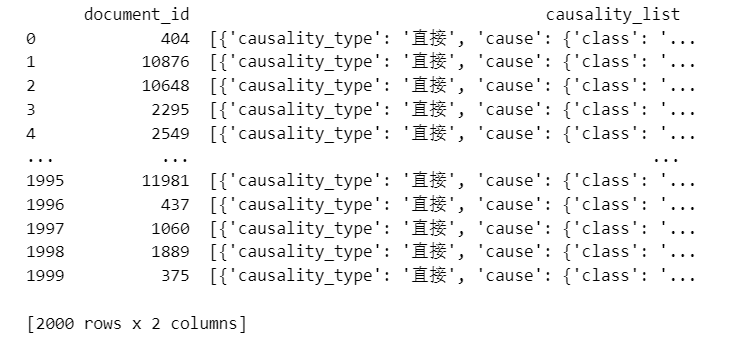
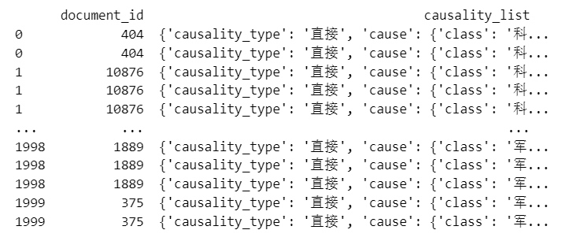
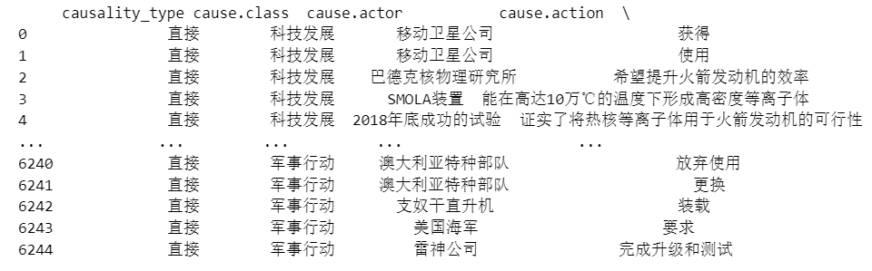
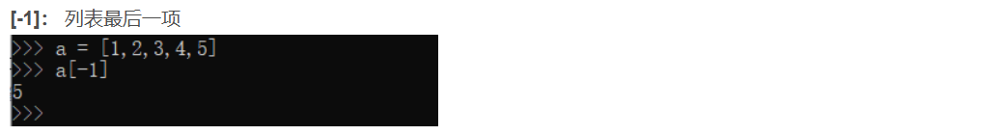
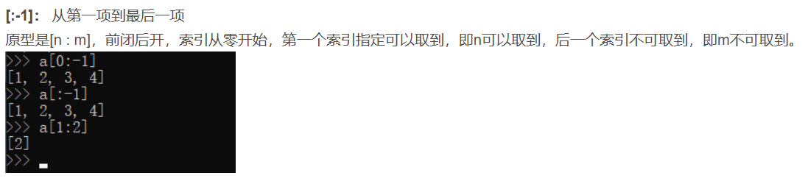
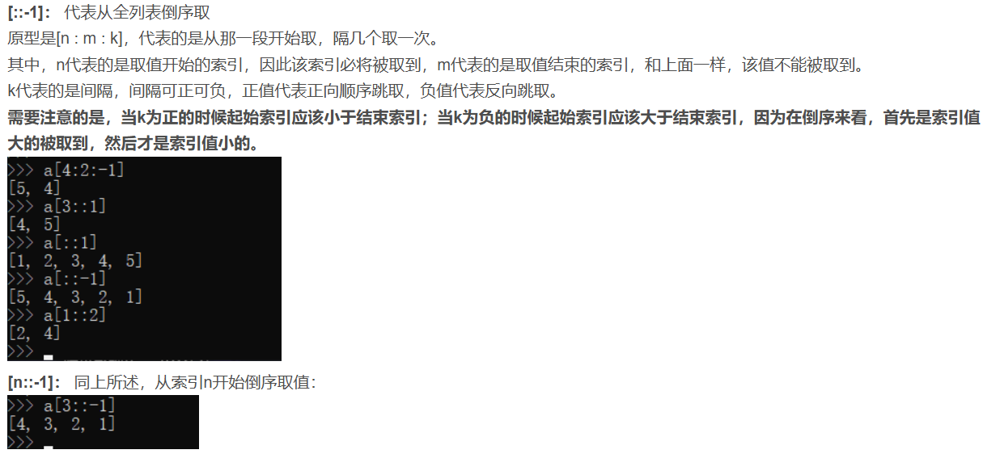
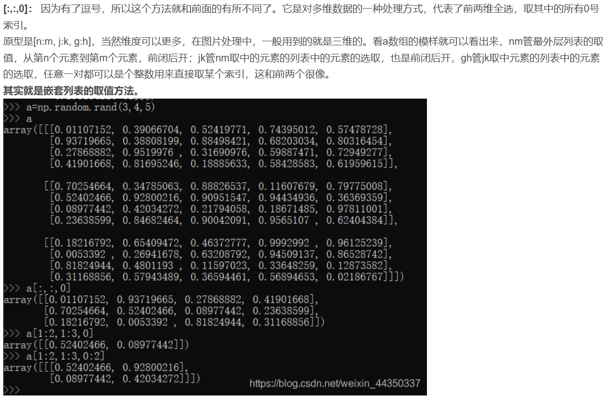
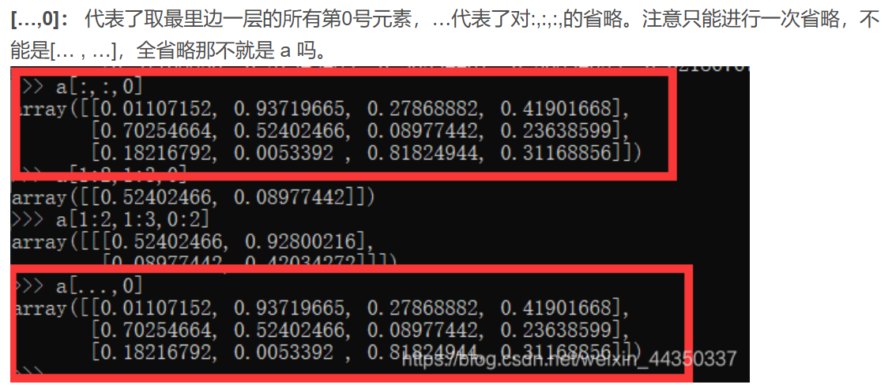

# 传统python

## pandas相关

```python
import pandas as pd
```

### 创建空pd

```py
df = pd.DataFrame(columns=['a_text', 'b_text', 'similarity'])
```

### 往空pd添加新数据：

```py
#ignore_index=True指按顺序重新添加索引
results = results.append({
            'a_text': ...
            'b_text': ...
            'similarity': ...
        }, ignore_index=True)
```


### 读取文件

```python
#读取json
data_train = pd.read_json('./data/train1.json')
#读取csv
df = pd.read_csv('./data/output.csv')
```

### 保存文件

```python
#保存为json
with open('result.json', 'w',encoding='utf-8') as json_file:
 output_json = json.dump(need_to_save_data, json_file,ensure_ascii=False, indent=2)
```

### 列名相关

#### 修改列名

```python
df.columns = ['test_text', 'train_text','document_id']
```

#### 删除列

```python
data= df.drop(columns=['text'])
```

#### 输出列

```python
print(df.columns)
```

#### 展开列



```py
#暴露里面内容
exploded_df = data.explode('causality_list')
```



```py
#解析内部json
expanded_df = pd.json_normalize(exploded_df['causality_list'])
```



### pd拼接

```python
merged_data = pd.merge(data1, data2, on='test_text', how='inner')
merged_data = pd.merge(data1, data2, on='test_text', how='outer')
merged_data = pd.merge(data1, data2, on='test_text', how='left')
```

### 定位pd

```python
#定位某行的某一个属性
print(df.iloc[0]['test_text'])
print(df['test_text'][0])
#输出前几行数据
print(df.head())
```

## Json相关

```python
import json
```

### 读取json

```py
with open(input_file_path, 'r', encoding='utf-8') as json_file:
    data = json.load(json_file)
```

### 保存json

```py
with open('output.json', 'w', encoding='utf-8') as json_file:
    json.dump(data, json_file, ensure_ascii=False, indent=2)
```


### 为json添加新属性

```py
#示例，为json中causality_list属性添加causality_type
for item in data:
    if 'causality_list' in item:
        for causality in item['causality_list']:
            causality['causality_type'] = "直接"
```


## 字符串相关

### 生成字符串

```python
input_text_cause = f"actor: {item['cause']['actor']} class: {item['cause']['class']} action: {item['cause']['action']} object: {item['cause']['object']} " \
                          f"Time: {item['cause']['time']} Location: {item['cause']['location']} "
```

### 切割字符串

```py
#默认以空格作为标记进行切割，返回一个列表
s.split()
```


## 列表相关

### 冒号相关

**注意冒号都是左闭右开**











### 列表合并

```py
# 假设五个 JSON 文件的名称为 file1.json, file2.json, ..., file5.json
file_names = ['file1.json', 'file2.json', 'file3.json', 'file4.json', 'file5.json']

# 用于存储合并后的数据
merged_data = []

# 读取每个 JSON 文件并合并数据
for file_name in file_names:
    with open(file_name, 'r', encoding='utf-8') as json_file:
        data = json.load(json_file)
        # 假设每个文件包含一个列表，将其合并
        merged_data.extend(data)
```


# 现代python

## transformers相关

### 传参相关

#### *args和**kwargs

1. 当你在函数定义中使用 `*` 时，所有传入的位置参数会被收集到一个元组中。

   ```py
   def func(*args):
       print(args)
   
   func(1, 2, 3)  # 输出: (1, 2, 3)
   ```

2. 当你在函数定义中使用 `**` 时，所有传入的关键字参数会被收集到一个字典中。

   ```py
   def func(**kwargs):
       print(kwargs)
   
   func(a=1, b=2)  # 输出: {'a': 1, 'b': 2}
   ```

### Dataset操作

#### 列表转Dataset

```py
dataset_train = Dataset.from_list(train_data)
```

#### 批量处理Dataset

```py
embeddings_a = dataset_train.map(preprocess_function, batched=True)
```

### 一些批处理函数

#### 将文本转为嵌入

```py
def preprocess_function(text):
    inputs = tokenizer(text['input_text'], return_tensors='pt', padding=True, truncation=True)
    with torch.no_grad():
        outputs = model(**inputs)
    embeddings = outputs.last_hidden_state[:, 0, :].numpy()
    return {"embeddings": embeddings} 
```

### 张量相关

#### np数组转pt张量

```py
import torch
import numpy as np
numpy_array = np.array([1, 2, 3, 4, 5])
torch_tensor = torch.from_numpy(numpy_array)
```

#### pt张量转np数组

```py
import torch
import numpy as np
torch_tensor = torch.tensor([1, 2, 3, 4, 5])
numpy_array = torch_tensor.numpy()
```

### Dataloader

```py
class Dataloader:
    def __init__(self,dataset,batch_size):
        self.dataset=dataset
        self.batch_size=batch_size
        self.cursor=0
        
    def __iter__(self):
        self.indexs=np.arange(len(self.dataset))
        self.cursor=0
        #打乱
        np.random.shuffle(self.indexs)
        return self
    
    def __next__(self):
        #从这里返回一个batch数据
        begin=self.cursor
        end=self.cursor+self.batch_size
        if end>=len(self.dataset):
            raise StopIteration()
        
        self.cursor=end
        batch_data=[]
        for index in self.indexs[begin:end];
            item=self.dataset[index]
            batch_data.append(item)
        return batch_data
```


### 一些算法

#### 找到每条a中text对应的最相似的五条b中text

```py
for i, emb_a in enumerate(embeddings_a):
    cosine_sim = cosine_similarity(emb_a.reshape(1, -1), embeddings_b)
    #argsort从小到大排序，[-5:]取最后五个，[::-1]反转列表
    top_indices = cosine_sim[0].argsort()[-5:][::-1]  # 找到前5个相似度最高的索引
    
    for idx in top_indices:
        results = results.append({
            'a_text': data_a['text'].iloc[i],
            'b_text': data_b['text'].iloc[idx],
            'similarity': cosine_sim[0][idx]
        }, ignore_index=True)
```

