# transformer结构

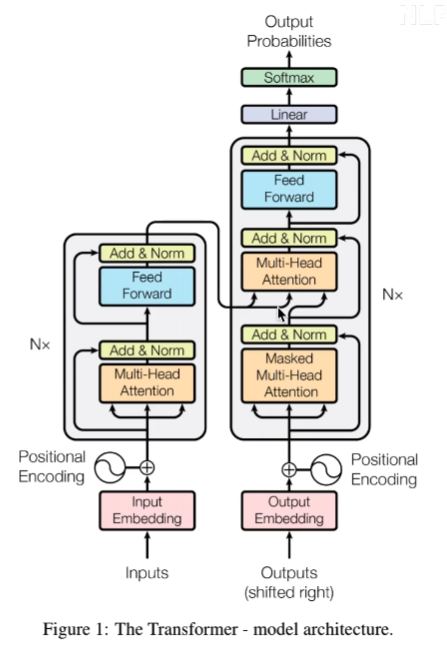

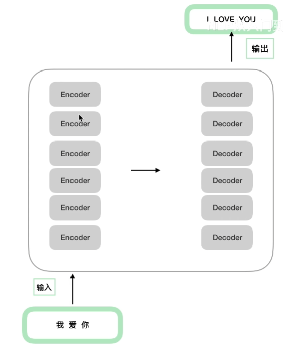

*encoder*结构相同，但参数都是独自训练，因此不同。

下面主要讲一下encoding的组成，分为以下三部分：

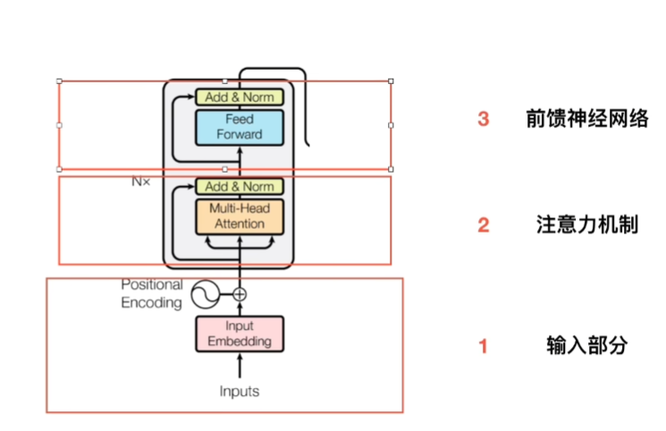

# 输入部分

输入为embedding和位置向量对位相加组成（0号位加0号位，1号位加1号位...）

## embedding

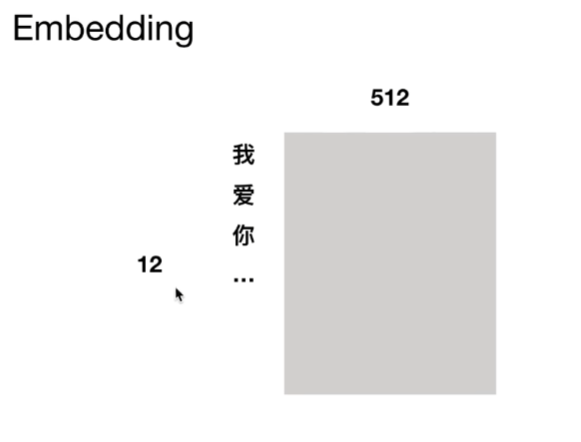

## 位置编码

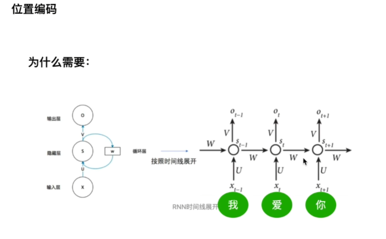

可以看到rnn是串行处理数据，transformer因为多头注意力可以并行处理数据。

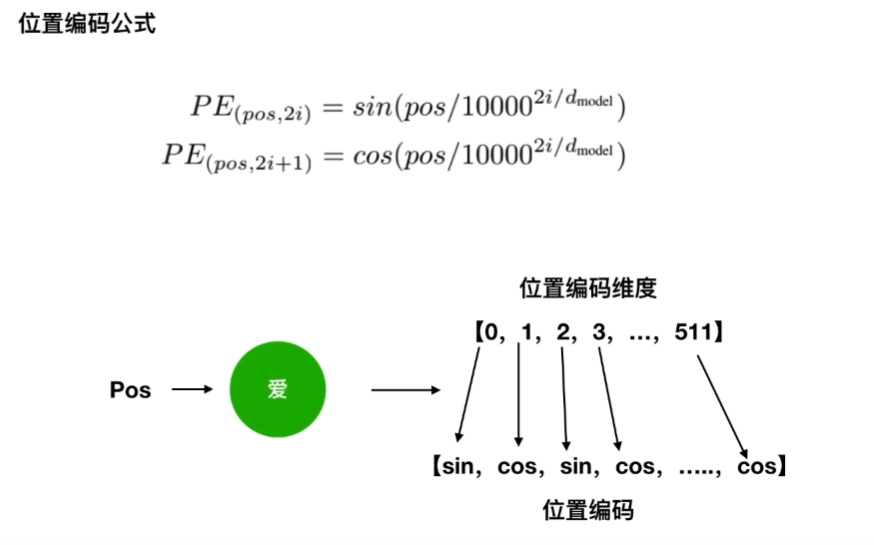

为什么用sin，cos后面再讲

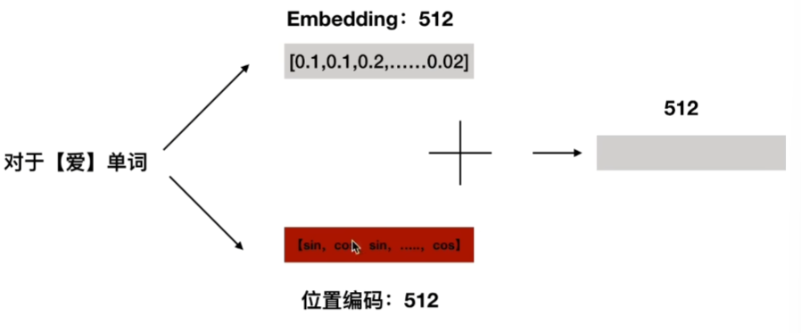

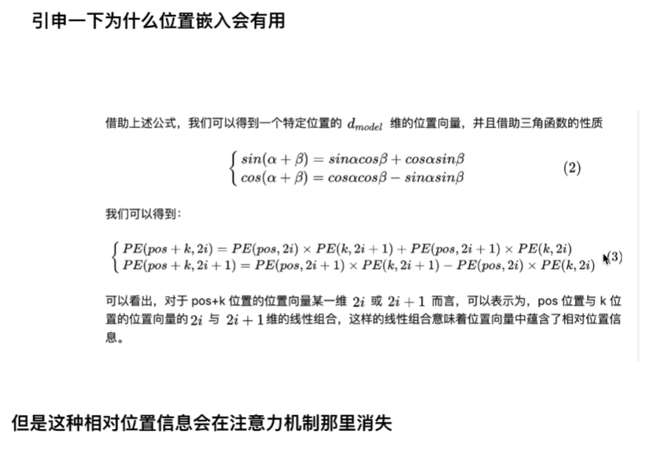

*pos*和*pos+k*都是绝对位置，*k*为相对位置，可以看到绝对位置*pos+k*的信息可以表示为绝对位置*pos*和相对位置*k*的线性组合。

# 多头注意力机制

## 自注意力机制

*wq,wk*和*wv*都是随机初始化，需要训练更新的权重参数，具体操作为：

1. 将输入词转为词向量，然后与*wq,wk*和*wv*相乘得到*qi,ki,vi(i=1,2,3,...n)*

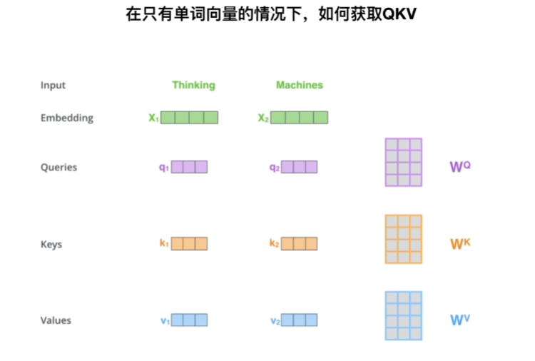

2. 对每个词对应的*qi*矩阵，将其与所有*ki*矩阵一一**点乘**得到n个标量，记为*scorei(i=1,2,3,...n)*。

3. 将n个*scorei*进行归一化操作，可以得到n个相加为1的注意力权重参数，表示*tokeni*对其他*token*的关注程度（如下图所示的0.88和0.12）

4. 将每个词对应的*vi*与其权重参数相乘，然后累和得到*zi*（如下图*z1=0.88v1+0.12V2*）

   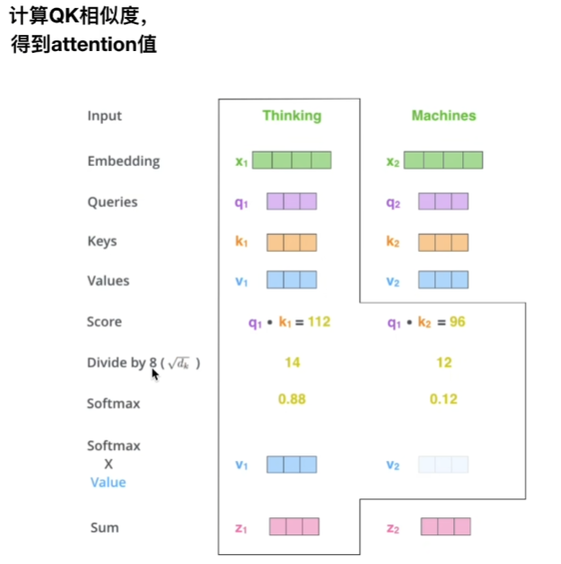

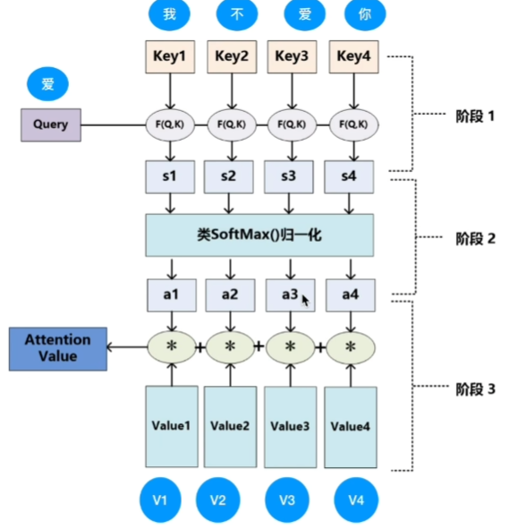

最后自己总结一下，其实Q和K的作用就只是计算出某个token与整句话中其他token的相关性，而V中才存放了该token的所有信息。

## 多头注意力

上述是一个头的情况，实际上对每个头都能得到一个Z矩阵，可以看到w参数都是独自训练不同的

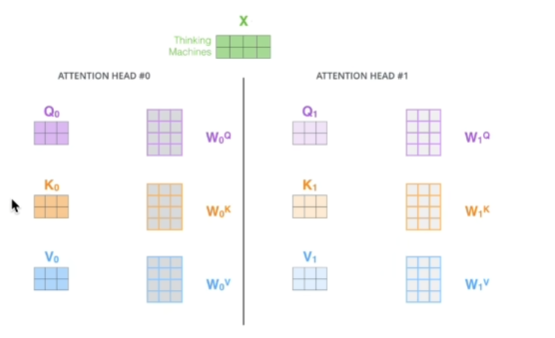

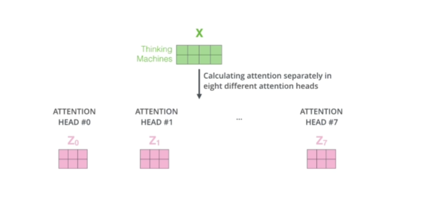

最终将每个头得到的矩阵拼接在一起，然后用一个附加的权重矩阵Wo与它们相乘。

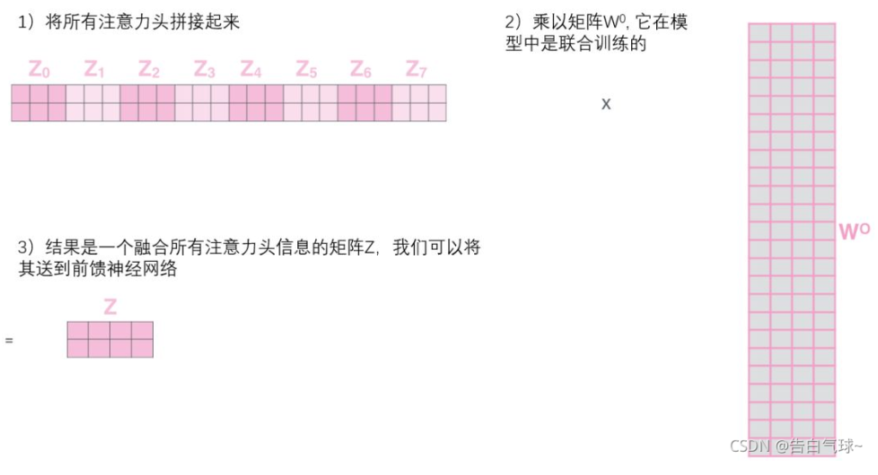

最终可以得到一个矩阵Z，则可将其送往**残差和layerNorm**模块。

# 残差 和 layerNorm

## 残差(Add)

残差网络能用于缓解梯度消失。

### 残差方法

将图中输入x经过两层网络得到的输出记为F(x)，则最终输出为F(x)+x。

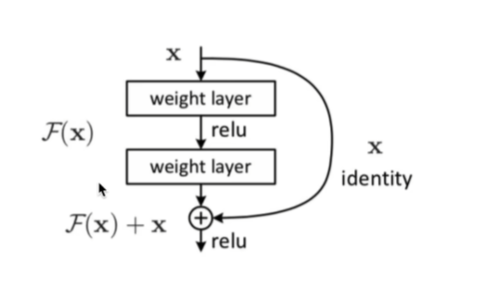

### 残差原理

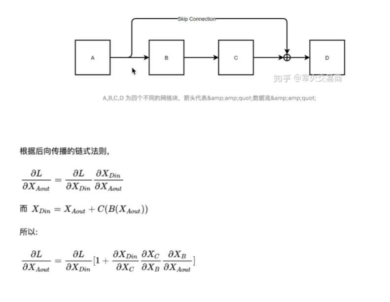

可以看到最下一层的结果因为始终有系数1的存在导致值不可能为0，也就避免了梯度消失。但是我没搞明白为什么是对*XAou*t求导，梯度更新的话应该是Loss函数对要更新的那个权重参数求导才对。

### 残差应用

在transformer里面，输入（词向量和位置编码的对位相加之和）对应x，x经过自注意层得到的输出z对应F(x)，x和z对位相加然后归一化得到最终的输出z'

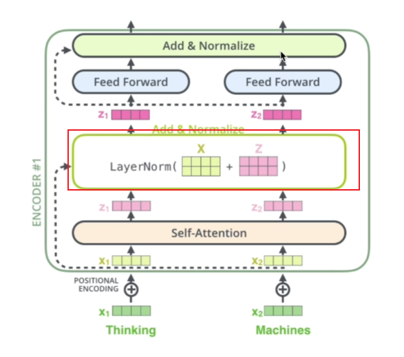

## layerNorm

ln就是对一个句子中所有词做均值方差，bn就是对不同句子间的词做均值方差，bn在nlp里面基本用不到。

# 前馈神经网络

前馈神经网络起始就是经过feed forward层（里面就是两层全连接），然后再过一次残差和标准化即可

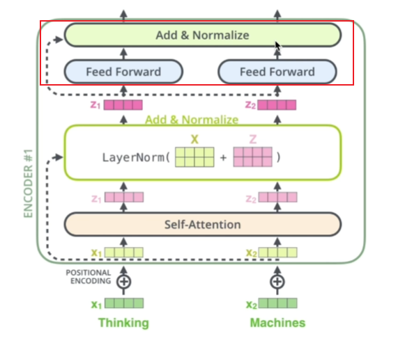