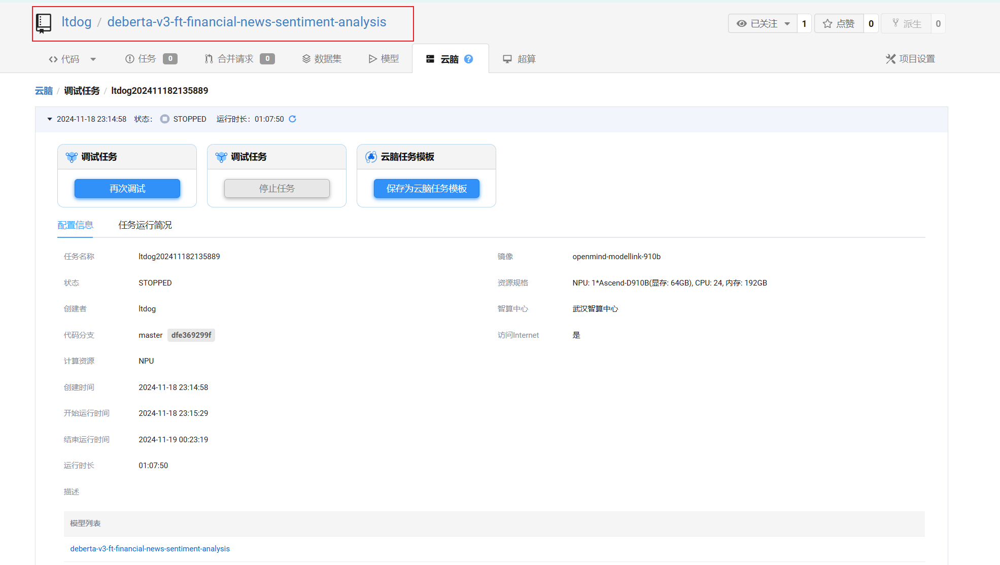
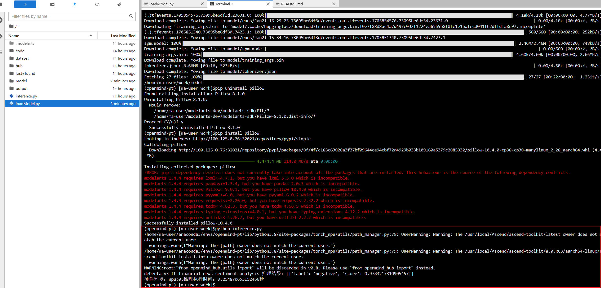
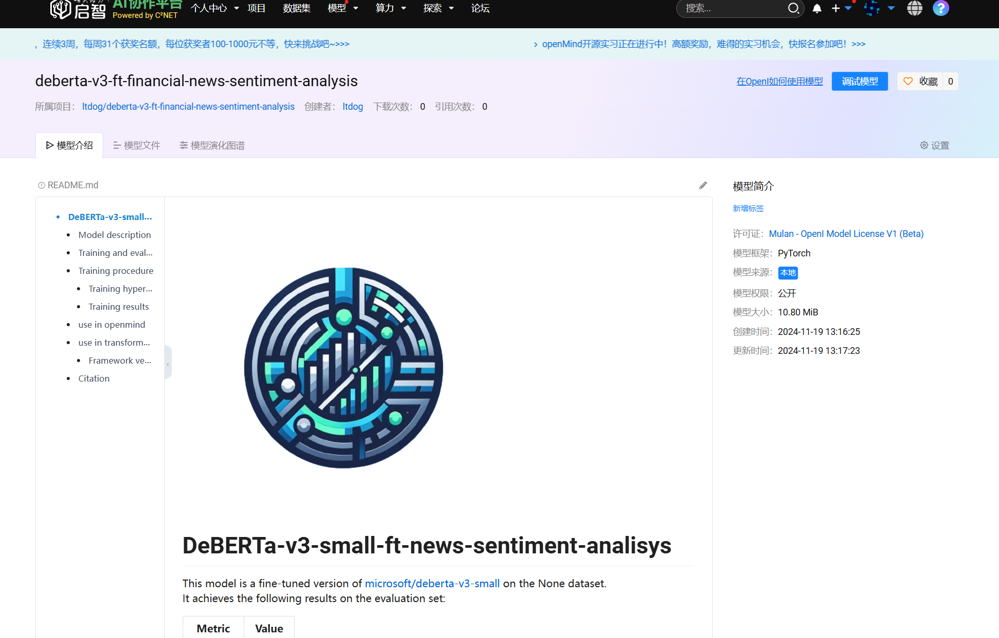
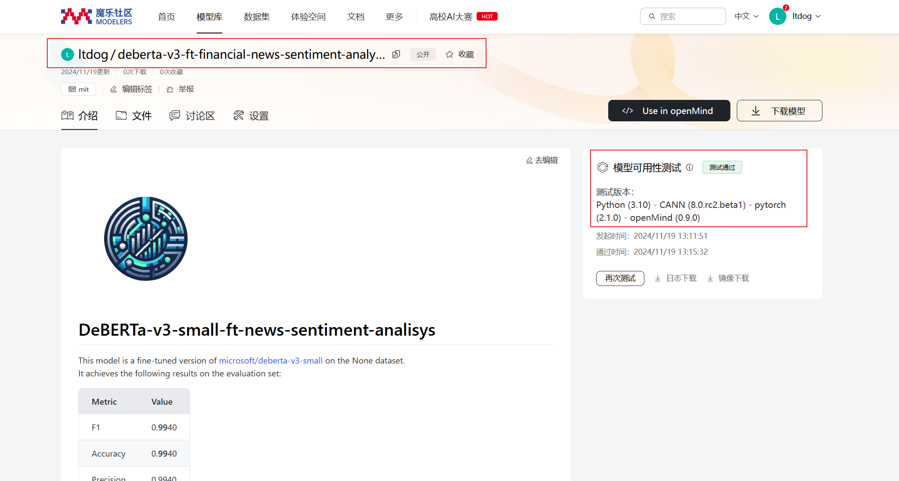

启智token: 42063b65f942a50fb0fa0e67b668ab814c848bce

魔乐write token: 8a4fb6236d66b95f920506f52e5e80e3cbf29ffc


# 总体流程

1. 新建脑项目，然后运行（不用上传本地模型）
2. 进入项目，建**模型目录**（命名为模型名），**loadModel.py**，**inference.py**，**upload.py**，**requirements.txt**
3. 先用loadModel.py加载模型，然后用inference.py实现推理，然后截屏推理结果
4. 将inference.py中内容写入模型readme文件中，然后在模型目录中新建**examples**文件夹，将inference.py和requirements.txt放在文件夹中，最后用upload.py上传模型到启智和魔乐，并截屏
5. 写任务模版并提交

# 上传模型

```
openi model upload 仓库名 模型名 本地模型路径
```

## 问题1

```bash
ImportError: cannot import name '_imaging' from 'PIL' 
```

## 解决方法1

进入自己的conda环境后
卸载PIL：

```bash
pip uninstall pillow
```

重新安装PIL:

```bash
pip install pillow
```

# readme修改

1. 直接添加一个 **use in openmind**

2. 代码模版：

   ```py
   from openmind import pipeline
   from openmind import AutoTokenizer, is_torch_npu_available
   from transformers import T5ForConditionalGeneration
   import torch
   
   import argparse
   import time
   
   def parse_args():
       parser = argparse.ArgumentParser()
       parser.add_argument(
           "--model_name_or_path",        type=str,
           help="Path to model",
           default="yxy/${path_name}",
       )
       args = parser.parse_args()
       return args
   
   def main():
       args = parse_args()
       model_path = args.model_name_or_path
       if is_torch_npu_available():
           device = "npu:0"
       else:
           device = "cpu"
   
           
       # 内容
   
       
       
   if __name__ == "__main__":
       main()
   ```

# 模型上传

1. 启智社区：

   ```bash
   pip install openi
   ```

   ```py
   # 上传到openi
   from openmind_hub import set_platform, create_repo, upload_folder, snapshot_download
   
   # 设置默认社区
   set_platform("openi")
   token = "42063b65f942a50fb0fa0e67b668ab814c848bce"
   
   # 创建模型
   create_repo(repo_id="ltdog/deberta-v3-ft-financial-news-sentiment-analysis", token=token)
   # 上传模型
   upload_folder(repo_id="ltdog/deberta-v3-ft-financial-news-sentiment-analysis", folder_path="deberta-v3-ft-financial-news-sentiment-analysis", token=token)
   ```

   ```bash
   python upload.py
   ```

2. 魔乐社区：

   ```python
   from openmind_hub import upload_folder
   
   # 使用upload_folder向仓库中上传文件夹。
       # token：对目标仓库具有可写权限的访问令牌，必选。
       # folder_path：要上传的本地文件夹的路径，必选。
       # repo_id：目标仓库，必选。
       # 若需对上传的文件类型进行过滤，可以使用allow_patterns和ignore_patterns参数，详见upload_folder。
   upload_folder(
       token="8a4fb6236d66b95f920506f52e5e80e3cbf29ffc",
       folder_path="deberta-v3-ft-financial-news-sentiment-analysis",
       repo_id="ltdog/deberta-v3-ft-financial-news-sentiment-analysis",
   )
   ```

   ```bash
   python upload.py
   ```

   


# 提交任务模版

### 任务1.deberta-v3-ft-financial-news-sentiment-analysis

### 原模型名称及在启智社区的地址

模型名称：deberta-v3-ft-financial-news-sentiment-analysis

原模型地址：https://huggingface.co/mrm8488/deberta-v3-ft-financial-news-sentiment-analysis

启智模型仓库URL地址：暂无

### 云脑调试任务名称及运行过程截图





### 基于openMind工具链完成适配后的模型名称及在启智社区、魔乐社区的地址

启智社区：https://openi.pcl.ac.cn/ltdog/deberta-v3-ft-financial-news-sentiment-analysis/modelmanage/model_readme_tmpl?name=deberta-v3-ft-financial-news-sentiment-analysis



魔乐社区：https://modelers.cn/models/ltdog/deberta-v3-ft-financial-news-sentiment-analysis



### 心得体验

第一次尝试模型迁移任务，踩了不少坑，也收获到了许多经验，比如下载模型在服务器上，直接从huggingface下载会出现网络异常，那么就可以从镜像站下载。