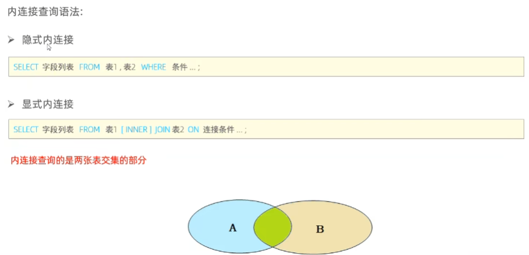

# SQL

## SQL语言

### DDL（数据定义语言）

#### 数据库操作


#### 表查询


#### 表创建


```sql
create table tb_user(
    id int comment '编号',
    name varchar(50) comment '姓名',
    age int comment '年龄',
    gender varchar(1) comment '性别'
) comment '用户表'
```

#### 表修改

```sql
-- 添加字段
alter table tableName add nickName varchar(20) comment '昵称';

-- 删除表
drop table if exists tableName;
-- 删除并重新创建
truncate table tableName;

-- 修改字段
-- 修改数据类型
alter table tableName modify nickName varchar(30);
-- 修改字段名和数据类型
alter table tableName change nickName userName varchar(30) comment '昵称';
-- 修改表名
alter table tableName rename to newTableName;
```


### DML（数据操纵语言）

#### 表添加数据

```sql
-- 给指定字段添加数据
insert into tableName(id,workNo,name,gender) values(1,'2','itcast','男');
-- 给全部字段添加数据
insert into tableName values(1,'2','itcast','男');
```

#### 表修改数据

```sql
update tableName set name = 'xiaoMing' where id = 1;
```

#### 表删除数据

```sql
-- 只能删除整个一条数据，删除字段用update
delete from tableName where id = 1;
```


### DQL（数据查询语言）


#### 聚合函数

```sql
select count(id) from tableName;
```

#### 分组查询

```sql
-- 查询年龄小于45的员工，根据工作地址分组，获取员工数大于3的工作地址
select workAddress, count(*) addressCount from tableName where age <45 group by workAddress having addressCount >3;
```

**where**和**having**的区别，可以看出**having**和**group by**绑定：


#### 排序查询

**order by** 默认升序（**asc**）

```sql
-- 先按照年龄进行升序排序，年龄相同则按照入职日期降序排序
select * from tableName order by age asc, entrydate desc;
```

#### 分页查询

```sql
-- 查询第一页员工数据，每页展示10条记录，0是起始索引，10是每页展示记录数
select * from tableName limit 0,10;
```


#### DQL执行顺序

 


### DCL（用户控制语言）

#### 管理用户

```sql
-- 查询用户
use mysql;
select * from userTableName;
-- 创建用户itcast，只能在localhost访问，密码123456
create user 'itcast'@'localhost' identified by '123456' ;
-- 创建用户itcast，可以在任意主机访问，密码123456
create user 'itcast'@'%' identified by '123456' ;
-- 修改用户密码
alter user 'itcast'@'%' identified with myPassword by '1234';
-- 删除用户
drop user 'itcast'@'%'
```

#### 权限控制

```sql
-- 查询权限
show grants for 'itcast'@'%';
-- 向itcast用户下itcast数据库下所有表授予所有权限
grant all on itcast.* to 'itcast'@'%';
-- 撤销权限
revoke all on itcast.* from 'itcast'@'%';
```


### 函数

#### 字符串函数


#### 数值函数


#### 日期函数


#### 流程函数


```sql
#查询员工名字和工作地址的映射
select
   name,
   (case workAddress when '北京' then '一线城市' when '上海' then '一线城市' else '二线城市' end) as '工作地址'
from tableName;
```


### 约束


#### 外键约束


### 多表查询

#### 多表关系

1. 一对多：
2. 多对多：
3. 一对一：

#### 连接

##### 内连接

##### 外连接

 

##### 自连接

一张表自己连接自己，需给自己定两个别名


#### 子查询

就是括号里面的内容


### 事务


```sql
-- 开始事务
start transaction;

-- 相关操作
-- select ...
-- update ...

-- 提交事务
commit;

-- 回滚事务
rollback;
```

#### 四大特性

 

#### 并发事务问题


#### 事务隔离级别

用于解决并发事务问题，隔离级别越高性能越差


