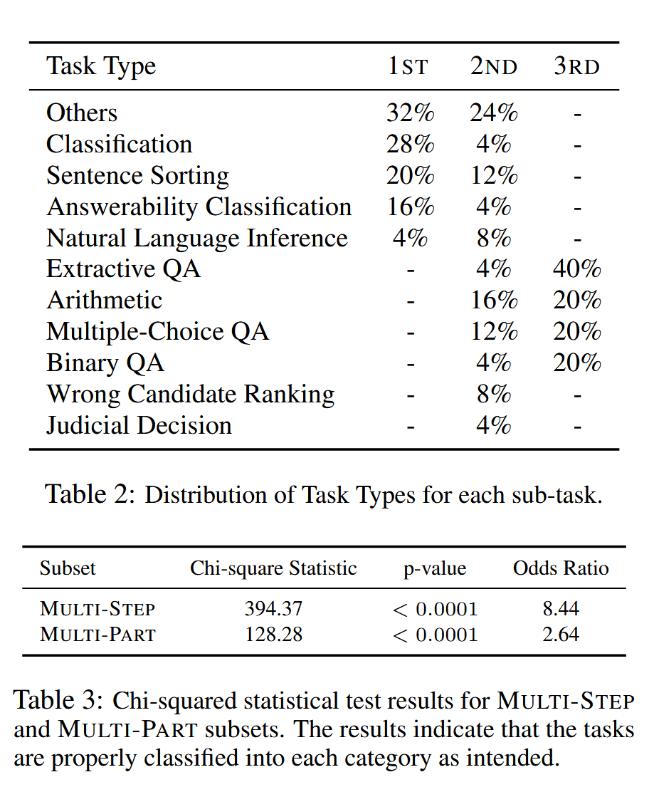

# 文献翻译

## 1. One-Shot Learning as Instruction Data Prospector for Large Language Models

### 摘要

当代的指令微调实践通常依赖于扩大数据规模，而没有确保数据质量的明确策略，这无意中引入了可能损害模型性能的噪声。为了解决这一挑战，我们提出了NUGGETS，这是一种新颖且高效的方法，通过一次性学习从庞大的数据集中识别并筛选出高质量的指令数据。NUGGETS评估每个指令示例作为有效一次性学习实例的潜力，从而识别出那些能够显著提升各种任务表现的示例。NUGGETS使用基于候选示例对多样化锚定集困惑度影响的评分系统，便于选择对指令微调最有利的数据。通过在MT-Bench和Alpaca-Eval两个基准上的全面评估，我们展示了使用NUGGETS筛选出的前1%高分示例进行指令微调，显著优于采用整个数据集的传统方法。

### 1 引言

大型语言模型（LLMs）在扩展模型规模和训练数据方面展示了显著的能力。然而，要进一步提升这些模型与人类指令的对齐度仍然是重要的任务。此对齐过程涉及对输入-输出对的监督微调（SFT），通常称为指令微调。指令微调不仅用于激活模型在预训练过程中获得的宝贵知识，还帮助它们与人类以自然对话的方式互动。

在指令微调领域的研究主要集中在收集更大、更丰富和更复杂的数据集上。通常通过人类众包或从更大型预先存在的模型中提取数据来实现。尽管用于指令微调的数据集规模不断扩大，某些研究表明，较小且高质量的数据集在充分挖掘LLMs的潜力方面更具优势。盲目扩大指令数据的数量而不确保其质量，可能会引入噪声并导致幻觉问题。然而，目前缺乏明确的标准来选择高质量的指令数据。传统做法依赖于经验性数据选择方法，这些方法会在数据组合的确定和根据结果的调整中引入偏差，这种试错方法增加了模型对齐的成本。我们假设最佳的指令组合在现有数据中已经存在，但仍缺少一种高效且经济的识别方法。

本文提出了NUGGETS，一种简单而高效的方法，通过一次性（上下文内）学习利用LLMs作为数据探测器，从庞大的指令数据集中提取高质量的、有价值的数据。NUGGETS以任务泛化能力为导向，提出了一个评分系统，以帮助识别具有潜力的“黄金指令”示例。这些示例可以作为一次性示例来进行一项特定任务，并在跨任务的广泛应用中表现出显著效果。我们首先选择了一个涵盖多个任务的集合，称为锚定集，候选指令数据集则是需要优化的数据集。然后，从候选集中逐个选择示例作为一次性示例进行上下文学习，并根据其对每个锚定示例困惑度的影响进行评分。此评分机制能够推断锚定示例和候选示例之间的依赖关系，为数据选择提供了参考标准。

为验证NUGGETS的有效性，我们在MT-Bench和Alpaca-Eval两个广泛认可的基准上进行了广泛评估。我们选择了一个流行且强大的LLM，即LLaMA作为我们的基础模型。实验结果显示，NUGGETS的数据筛选策略相比于传统的微调方法有显著提升，尤其是仅使用最高得分1%的指令示例时，其表现优于使用完整指令数据集的效果。

我们总结了主要贡献如下：

- 我们提出了NUGGETS，这是一种利用LLMs动态评估指令示例质量的方法。NUGGETS旨在从庞大的指令数据集中提取最有价值的数据用于微调。
- 仅使用得分最高的前1%指令示例进行微调，其效果优于使用整个指令数据集。这一结果强调了优先考虑训练数据的质量和策略组合的重要性，而非单纯的数据量。
- 广泛实验的结果验证了“黄金指令”的假设，表明一个指令示例的有效性可以通过其在微调后提升任务泛化能力的影响来衡量。这一观察为未来的数据质量筛选提供了宝贵的启示。

### 2 相关工作

**指令微调**
近期的研究提出了一系列技术，以优化大型语言模型（LLMs），展示了它们对之前未遇指令的泛化能力。例如，T5开创了将各种自然语言处理任务转化为统一文本到文本格式的初步尝试。FLAN引入了指令微调的概念，旨在通过在模型训练期间将NLP任务转换为自然语言指令，提高零样本任务的表现。此外，InstructGPT处理了大量由人类创建的多样化任务和广泛的任务类型，以适应真实用户的需求。由于这些著名项目的源代码未公开，后续的研究（如Alpaca和Vicuna）采用了开源的LLM（如LLaMA）来进一步探索开放领域的指令微调。

**指令构建**
现有的指令微调数据集通常是手动创建的，或专门针对特定任务设计的。为了减轻大量人工标注和数据收集的负担，各种半自动技术相继出现。Self-Instruct随机选择初始任务池中的少量实例，作为示例指导语言模型生成新的指令及其对应的输入-输出对。Evol-Instruct采用了逐步修改的策略来优化原指令，以便精确控制生成指令的难度和复杂度。与Self-Instruct或Evol-Instruct不同，Tree-Instruct通过指导LLMs在现有指令的语义树上添加新的节点来生成指令，而不是直接操控文本序列。

相反，一些研究专注于通过利用较少但质量更高的指令示例来增强LLMs的性能。LIMA通过战略性地选择一千条高质量数据点进行学习，展现了极强的性能。InstructMining引入了一系列精心挑选的自然语言指标，用于评估指令跟随数据的质量。需要注意的是，此方法需要将数据分割成多个桶，因此在评估单个示例的质量时存在局限性。INSTAG提出了一种开放集指令标签方法，通过标签识别人类指令的语义和意图，为指令多样性和复杂性的量化分析提供了定义。此外，ALPAGASUS利用ChatGPT的强大能力直接评估每个示例。尽管这种方法效果显著，但其显著局限在于难以考虑各模型在微调过程中固有的差异，主要依赖ChatGPT的偏好。尽管Li等人提出了一种自我引导的数据选择方法，但仍需初步微调模型，增加了后续操作的不确定性。

### 3 NUGGETS

**动机**
如图1所示，传统增强LLMs指令数据的方式主要依赖于经验方法。这些方法包括应用启发式规则、专家分析和基于模型性能反馈的数据迭代调整。显然，这种试错方法在人力和计算资源方面成本高昂。

近期研究一致认为，指令微调显著增强了预训练模型在各种任务中的任务泛化能力。基于此，我们提出了“黄金指令”假设：指令示例的有效性可以通过其在微调后的任务泛化能力提升来衡量。随着改进幅度的增大，指令逐渐趋向于“黄金指令”分类。

根据这一假设，一种简单的方法是使用指令示例微调一个独立模型，然后将微调模型在多任务预定义数据集上的表现与基础模型进行对比，以判断该示例是否符合“黄金指令”的标准。然而，这种方法会导致微调模型的数量与指令数相同，难以实际操作。此外，仅使用一个示例进行微调可能导致模型梯度的不稳定更新，使得难以确定示例的真正作用。

#### **3.1 算法细节**

**零样本评分**  
给定一个预定义的任务集，其中包含m个任务，每个任务结构为[任务（T）、答案（A）]。任务或答案中的每个单词分别表示为$w_{T_i}$或$ w_{A_i}$

。设LLM为我们使用的预训练大型语言模型。对于第j个任务$T_j $，模型通过根据给定任务和前置单词连续预测下一个词来计算零样本推理概率：

$$
s_{j}^{zsl} = \frac{1}{L} \sum_{i=1}^{L} \log p(w_{A_j} | C; LLM)
$$
其中，L为答案A的单词数量，$s_{j}^{zsl}$用于表示模型在第j个任务上的熟练度。较高的$s_{j}^{zsl} $值代表模型在该任务上的表现越好，较低的值则表示较差的表现。因此，我们可以获得模型在m个任务上的表现：

$$
S^{zsl} = [s_{1}^{zsl}, s_{2}^{zsl}, \ldots, s_{m-1}^{zsl}, s_{m}^{zsl}]
$$
**一次性学习评分**  
给定一个指令微调数据集D，我们旨在识别一个最符合黄金指令的示例集 $D^{gold}$ 。对于每个示例$z_k = [InstructionQ_k (IQ_k), InstructionA_k (IA_k)] $，我们最初使用该特定示例对基础模型执行隐式指令微调。其中，$InstructionQ_k$ 表示与示例$z_k$ 相关的问题， $InstructionA_k$ 表示相应的答案。随后，我们使用上下文学习再进行一次在预定义任务集上的测试：
$$
s_{j}^{iit}(z_k) = \frac{1}{L} \sum_{i=1}^{L} \log p(w_{A_j} | IQ_k, IA_k, C; LLM)
$$
其中，\($ IQ_k$ \)和\( $IA_k $\)可以被视为一次性提示。同样，我们可以得到模型在隐式微调后的m个不同任务上的表现：

$$
S^{iit}_k = [s_{1}^{iit}(z_k), s_{2}^{iit}(z_k), \ldots, s_{m}^{iit}(z_k)]
$$
之后，我们使用黄金评分（$GS$）来反映该指令微调示例对基础模型的影响。示例\( $z_k $\)的GS计算如下：

$$
GS(z_k) = \frac{1}{m} \sum_{i=1}^{m} I[s_{i}^{iit}(z_k) > s_{i}^{zsl}]
$$
其中，\($ I[\cdot] $\)为指示函数。从高层次来看，$GS$衡量了通过一次性学习，该指令对模型性能提升的程度。

在此研究中，我们计算了每个指令示例的$GS$分数，从而生成涵盖所有示例的排序列表。我们的目标是通过选择性地使用少量最关键的示例对基础模型进行显式微调，特别是优先选择高$GS$的示例，以期取得优于使用整个数据集的效果。

### 4 实验

#### **4.1 实验设置**  

**指令数据集**  
我们采用了Alpaca数据集作为指令数据源。Alpaca数据集通过自我指令方法从text-davinci-003模型中提取指令数据，是开源社区中指令微调的重要资源。该数据集在微调LLaMA模型上的成功激发了对指令微调的一系列探索。此外，我们还使用了多种指令数据集以验证NUGGETS的可转移性。

**预定义任务集**  
预定义任务集在计算指令的黄金分数时起到关键作用。这些数据用于评估模型在各种任务上的泛化能力。预定义任务集的数据量和任务种类决定了其适用性。Alpaca数据集具有这些属性，因此我们随机从中选取1000个样本组成预定义任务集。

**评估数据集**  
本研究采用了两种方法来评估模型能力。第一种方法是对模型生成的响应进行1到10分的评分，为此我们采用了GPT-4标注的MT-Bench数据集。MT-Bench评估模型在写作、角色扮演、提取、推理、数学、编程、STEM和人文学科八个类别上的指令跟随能力。由于我们仅在单回合指令数据上进行微调，因此仅限于MT-Bench的第1回合。第二种方法则是将模型的生成响应与Davinci-003模型的响应进行对比，使用Alpaca-Eval数据集作为评估标准，并采用“赢率”作为评估指标。

**实现细节**  
在实验中，我们选用了LLaMA-7B模型作为基础模型。为确保公平比较，我们设置了与LLaMA一致的最大输入长度（2048）。在模型微调阶段，我们采用Adam优化器，学习率为2×10⁻⁵，批量大小为64，并训练3个epoch。在模型评估阶段，所有参数设置与原始工作保持一致。

#### **4.2 实验结果**

Alpaca数据集包含总共52,002个指令示例，其黄金分数分布在附录A中展示。在这些示例中，有42,460个示例的黄金分数超过0.5。此外，我们选择了与黄金指令密切相关的一个子集，即黄金分数超过0.8和0.85的示例。特别地，有7,525个示例的黄金分数超过0.8，有619个示例的分数超过0.85，后者仅占整个数据集的1%。

我们对LLaMA模型使用了按黄金分数划分的不同子集进行指令微调：包括分数小于0.5的子集、大于0.5的子集、大于0.8的子集、大于0.85的子集，以及整个数据集。微调模型分别标记为Alpaca≤0.5、Alpaca>0.5、Alpaca>0.8、Alpaca>0.85和Alpacafull。

**主要结果**  
实验结果见表1和表2，分别对应Alpaca-Eval和MT-Bench基准。如预期所示，Alpaca>0.8表现最为优异，这归因于其在指令数量和质量之间实现了最佳平衡。我们还注意到，质量较低的指令会对模型微调产生负面影响。Alpaca≤0.5的表现明显低于Alpacafull，而Alpaca>0.5略微优于Alpacafull。值得注意的是，Alpaca>0.85仅使用1%的数据集进行微调，其效果甚至可以媲美甚至超越Alpacafull。这表明了我们数据选择方法的有效性。

**图3的分数分布**  
在不同的预定义任务集上计算Alpaca数据集的黄金分数分布，并展示相应的Alpaca-Eval基准上的微调结果。

**预定义任务集上的消融实验**  
为了评估不同预定义任务集如何影响微调的数据选择，我们引入了两个额外的预定义任务集变体。一个是从Alpaca数据集中随机选取的100个样本，另一个则是使用K-Means算法将Alpaca数据集聚类成100个簇，并将每个簇的中心样本作为任务集。

我们分别使用这两个预定义任务集计算Alpaca数据集的黄金分数。黄金分数的分布如图3所示。我们选择了黄金分数小于或等于0.5、大于0.5、大于0.6、大于0.7、大于0.8、大于0.85和大于0.9的指令数据用于模型微调。表3显示，随着随机采样任务集规模的增大，可以更有效地识别高质量的指令数据。这是因为较大的任务集包含更广泛的数据，从而能够更细致地评估指令对模型任务泛化的影响。然而，当使用K-Means算法为任务集选择更多独特示例时，使用仅100个样本的K-Means方法结果优于随机采样得到的1000个样本。在这种情况下，仅用5419个Alpaca>0.8示例的K-Means方法表现优于拥有7524个随机采样的示例。这一结果也间接证实了我们的黄金指令假设的有效性。

**指令集上的消融实验**  
为深入研究NUGGETS在不同指令数据集上的泛化能力，我们在Alpaca-GPT4数据集上进行了一系列实验。该数据集从强大的GPT-4模型生成指令数据，并且与Alpaca数据集共享相同的问题指令，因此便于直接比较。

受表3启发，我们对Alpaca-GPT4数据集应用K-Means算法，采样100个示例形成预定义任务集。随后，我们使用NUGGETS方法为数据集中所有指令打分，如图4所示。与Alpaca数据集相比，Alpaca-GPT4数据集中具有较高黄金分数的指令数量更多：有25,100条指令的得分超过0.8，有16,943条超过0.85，4,250条超过0.9。这些数量远超Alpaca数据集中对应的高分指令数量。这也表明黄金分数可以作为评价指令数据质量的绝对指标。模型微调结果显示，在Alpaca-GPT4数据集上，结论与之前实验一致。微调使用黄金分数小于等于0.5的子集的模型在Alpaca-Eval基准中的表现最差，仅有19.23%的赢率。而使用分数大于0.85的子集进行微调的模型表现最佳，赢率高达72.05%。这种成功归因于此子集在数量和质量上的双重保障。值得强调的是，即使在较小且高质量的数据集上微调的模型，其效果也始终显著优于在完整数据集上微调的结果。总体而言，使用Alpaca-GPT4微调的模型明显优于使用Alpaca微调的模型。

这也间接证实了Alpaca-GPT4数据集在质量上优于Alpaca数据集。更多关于指令数据集的实验见附录B。

**基础模型上的消融实验**  
为了验证NUGGETS方法的可迁移性，我们在不同的基础模型上使用Alpaca指令数据集进行了实验。我们选择了LLaMA2和Mistral这两个7B参数的模型作为新的基础模型。黄金分数的分布和模型在相应指令子集上的微调表现如表4所示。我们发现NUGGETS方法同样适用于其他模型。在黄金分数大于0.85的子集上进行微调时，LLaMA2模型取得了34.98的最佳结果，显著高于使用完整数据集的26.47分。尽管Mistral系列微调模型的赢率绝对值较低，但其表现也因NUGGETS的数据筛选而显著提升。

### 5 讨论：一次性学习作为隐式指令微调

Transformer已成为语言模型的主流架构，其中自注意力机制作为关键元素。设\( $X_{ins}$ \)和\( $X_{test}$ \)分别表示指令微调样本和测试输入。\( $X_{ins}$ \)类似于公式3中的\($ IQ_k$ \)和\( $IA_k$ \)，而\( $X_{test}$ \)类似于\( $T$ \)和前几个\( $w_{A}$ \)。定义\( $Q = W_Q X_{test}^\top$ \)为查询向量，\( $K = W_K [X_{ins} \| X_{test}]$ \)为键向量，\( $V = W_V [X_{ins} \| X_{test}]$ \)为值向量，其中\( \| \)表示拼接操作，\( $W_K$ \)、\( $W_V$ \)和\( $W_Q$ \)分别为投影矩阵，用于计算查询、键和值向量。自注意力机制在任意层的计算结果为：

$$
Attention(K, V, Q) = W_V [X_{ins} \| X_{test}] \cdot Softmax \left(\frac{W_K [X_{ins} \| X_{test}]^\top Q}{\sqrt{d_{in}}}\right) \approx W_V X_{test} \cdot (W_K X_{test})^\top Q + W_V X_{ins} \cdot (W_K X_{ins})^\top Q
$$
其中，\( $\sqrt{d_{in}}$ \)为缩放因子。项\($ W_V X_{test} \cdot (W_K X_{test})^\top$ \)表示零样本学习场景，因为它仅关注测试输入。此外，项\( $W_V X_{ins} \cdot (W_K X_{ins})^\top $\)可以视为通过指令样本实现的隐式指令微调\( $\Delta W_{iit} $\)，通过从指令样本中获得的元梯度实现。

### 6 结论

本文提出了NUGGETS，一种利用LLMs辨别指令微调关键数据的方法。该方法基于一次性学习，识别示例的价值，从而无需额外的标注和相关成本即可实现高效的数据选择。受益于NUGGETS，我们观察到即使在较小的训练子集上，指令跟随能力也得到了改善。此外，我们认为该方法强调了数据精心选择的重要性，为未来的指令微调工作提供了宝贵的见解。

**局限性**

尽管通过实验证明了该方法的有效性，但仍有改进空间。一方面，可以深入研究在黄金评分阶段包含多样且紧凑的预定义任务集，从而提升模型在指令数据上的评估效率，以更好地识别适合后续微调的高质量指令。其次，由于资源限制，本研究的实验大多集中在LLaMA-7B模型上。虽然该模型在开源社区中具有重要影响力，但为了确保方法的通用性，有必要在更广泛的模型范围上进行验证。最后，为了进一步巩固本研究结果的经验基础，重要的是在更多的指令数据集上验证该方法，以确保其在不同指令上下文中的稳健性和适用性。这些未来的研究方向有望进一步完善和拓展所提出方法的应用范围。

**致谢**

本研究得到了中国国家重点研发计划、国家自然科学基金、广东省自然科学基金、深圳科技创新项目、深圳基础研究基金以及阿里巴巴创新研究计划的支持。Xiaobo Xia得到了澳大利亚研究委员会项目和谷歌博士奖学金的支持。Tongliang Liu得到了多项澳大利亚研究委员会项目的部分支持。

## 2. SirLLM: Streaming Infinite Retentive LLM

### 摘要

随着大型语言模型 （LLM） 在各个领域中变得越来越普遍，它们处理任何长度的输入并保持一定程度的内存的能力变得至关重要。然而，过长文本的一次性输入是有限的，因为研究表明，当输入长度超过 LLM 的预训练文本长度时，文本生成能力会急剧下降。此外，简单地延长预训练文本的长度是不切实际的，因为很难获得长文本数据，而且这会给 LLM 带来大量的内存消耗成本。最近的努力采用了流式输入来减轻过长文本输入的压力，但这种方法会严重损害模型的长期记忆能力。 

受此挑战的启发，我们引入了 Streaming Infinite Retentive LLM （SirLLM），它允许 LLM 在无限长度对话中保持更长的内存，而无需微调。SirLLM 利用token熵指标和内存衰减机制来过滤关键短语，从而赋予 LLM 持久和灵活的内存。我们设计了三个不同的任务并构建了三个数据集，从不同角度衡量 SirLLM 的有效性：（1） 每日对话;（2） 杂货店购物;（3） 石头剪刀布。我们的实验结果有力地表明，SirLLM 可以在不同的 LLM 和任务中实现稳定和显着的改进，令人信服地证明了其有效性。当有遮盖物时，“先生可以忘记自己”，但 SirLLM 永远不会！我们的代码在 https://github.com/Zoeyyao27/SirLLM 上公开提供

### 1 引言

 大型语言模型 （LLM） 的激增刺激了各种 NLP 应用的发展，包括广泛使用的工具，如聊天机器人、写作助理和编程助理。这些应用程序旨在增强用户交互和对话体验，通常需要无限的输入长度和一定程度的内存能力。然而，当前的 LLM 通常是在有限长度的文本上进行预训练的，研究表明，当输入长度超过预训练文本时，它们的文本生成能力会急剧下降。仅仅延长预训练文本的长度是不切实际的，因为获取无限长的文本数据非常具有挑战性，更不用说这会导致 LLM 的大量内存消耗。因此，研究如何使 LLM 能够在保持内存能力的同时处理无限输入长度是一个亟待解决的问题。

随着这种需求的出现，研究人员逐渐将重点转移到探索扩大 LLM 的输入上下文长度的方法上。Beltagy等人 首先提出了滑动窗口注意力，如图 1  所示。通过将每个token限制为仅关注一定数量的最近token，此方法降低了计算复杂性。在部署场景中，LLM 利用键值 （KV） 缓存来存储每个生成步骤中过去 Token 的键和值张量，以有效减少重新计算过去 Key 和 Value Tensor 的需求，降低计算开销。因此，即使 KV 缓存已满，滑动窗口注意力也能确保稳定的解码速度，从而在预训练阶段允许更长的文本。然而，Xiao 等人发现，这种方法并不能真正实现无限输入长度，因为一旦输入长度超过 KV 缓存的大小，模型的性能就会显着恶化，然而，受到的关注量不成比例地高，这种现象被称为 “注意力沉没”，如图 2 所示。因此，他们提出了 StreamLLM，如图 1 （b） 所示。StreamLLM 通过保留初始token的 KV 缓存来增强窗口注意力的潜力，从而在流式对话中实现无限长度的输入，而无需微调。然而，虽然 Sliding-window Attention 和 StreamLLM 确保了扩展的输入长度，但每个生成的 Token 只关注最近的 Token（和初始的 attention sink Token），导致对话的早期部分的内存丢失。这导致了远距离对话中一个严重的遗忘问题。此外，如图 2 所示，该模型关注的最近标记的范围不是很广泛。这一观察结果让我们思考，在对话过程中，模型是否有可能只关注关键术语，过滤掉不太重要的标记。通过仅记住关键信息，该模型可能能够在无限长的对话上下文中保持更长的内存跨度。

为了应对上述挑战，我们在本文中提出了流式无限保持 LLM （SirLLM），如图 1 （d） 所示。最初，我们使用 LLM 来计算每个输入标记的标记熵度量，从而评估它们的重要性。随后，具有较高token熵值的token（被视为密钥token）将保留在 KV 缓存中。此方法增强了模型在无限长流式对话上下文中的内存能力。为了验证 SirLLM 的有效性，我们在三个不同的任务中进行了实验：（1） DailyDialog：我们基于 DailyDialog 数据集创建了一个多轮次日常对话数据集。（2） 杂货店购物：我们开发了一个杂货店购物数据集。用户首先通知 LLM 他们需要购买的杂货。在此之后，用户与 LLM 进行多轮对话，最终用户要求 LLM 召回所需的杂货。（3） 石头剪刀布：我们构建了一个石头剪刀布数据集，其中包含三种类型的玩家，每种玩家都偏爱三种动作（石头、布、剪刀）中的一种。玩家使用 LLM 进行多轮石头剪刀布，LLM 的任务是分析用户的历史偏好以最大限度地提高其获胜率。这些实验的结果有效地证明了 SirLLM 在无限对话中增强的记忆能力。

### 2 相关工作 

许多工作专注于通过优化注意力机制来扩展 LLM 的输入上下文长度。Beltagy 等人首先提出了滑动窗口注意力，它让每个token只关注一定数量的最近token。当 KV 缓存已满时，滑动窗口 attention 会丢弃最早的 token，以保持稳定的解码速度和性能。Child等人提出了固定的稀疏变换器。从形式上讲，此方法最初将最近标记的键和值状态保留为本地上下文信息。随后，它采用具有指定步幅的列注意力机制。此机制汇总了来自先前位置的信息，并将其传播到所有未来的token，作为一种全局关注的形式。Li等人提出了一种 LogSparse 自我注意，其中每个元素只能以指数步长关注自身及其先前的单元。Xiao等人介绍了注意力沉降现象，并提出了 StreamLLM，这是一种专门为实现真正的无限输入长度而设计的模型。StreamLLM 在其注意力计算期间，保持对初始 token 和最近 token 的关注。此方法可确保在无限流式对话的上下文中保持稳定的性能。

然而，上述方法要么以给定的步幅保存token，要么随机选择，要么不保留历史token的键值 （KV） 缓存，从而导致模型中出现严重的遗忘问题。SirLLM 通过利用 LLM 本身来计算token熵来解决这个问题，有选择地保留具有最高熵的token的 KV 缓存。这种方法有效地节省了内存空间，确保只保留最关键的信息。

另一条相关工作线是 KV 缓存优化。Ge等人介绍了 FastGen，这是一种用于大型语言模型的自适应 KV 缓存压缩方法。FastGen 首先分析各种注意力头的行为，为每个头选择最有效的压缩策略，并通过将所选的压缩策略应用于每个token，而不仅仅是附加新的 KV 向量，在生成新token时优化 KV 缓存管理。Zhang等人提出了 H2O ，这是一种 KV 缓存驱逐策略，可动态平衡最近的token和重磅token。驱逐策略被构建为一个动态的子模块问题，使用注意力分数在 KV 缓存中保留最有影响力的token。贪婪算法为近乎最佳的性能提供了理论保证。然而，这些工作更侧重于 KV 缓存优化，而不是多轮对话的流场景和增强 LLM 的内存能力。

与我们研究相关的另一类工作是上下文压缩。Li等人 通过选择基本语言模型计算的具有更高自我信息的词汇单位（标记、短语、句子）来压缩输入上下文。Berchansky等人 提出了一种标记过滤方法，用于优化检索到的长文档以加快解码过程。这种方法涉及使用在所有注意力头的特定层计算的平均交叉注意力分数，以消除不太关键的标记。然后，仅保留得分最高的前 k% 的输入token，并将其用于预测后续token。尽管基于检索的方法可以根据输入识别更准确的上下文，但它们通常需要更多的计算和时间资源。相比之下，SirLLM 不需要维护额外的向量数据库，也不会中断模型的端到端计算过程。SirLLM 可以显著有效地增强模型的内存能力，而无需修改模型的架构或需要微调。

### 3 Method  

#### **3.1 Preliminaries**

Xiao 等人提出了 StreamLLM。他们发现，该模型不成比例地关注初始token，并在删除初始token的 KV 缓存时中断。因此，基于滑动窗口的关注，他们不会丢弃除最近token的 KV 缓存之外的所有先前的 KV 缓存，而是保留第一个初始token KV 缓存，如图 1 （c） 所示。图 1 （c） 说明了 StreamLLM 流程，可以表述如下。我们将注意力接收器标记和最近的标记的索引分别定义为 $Id_{sink}$ 和 $Id_{recent}$：
$$
Id_{sink} = \{0, 1, ..., n_{sink}\}
$$

$$
Id_{recent} = \{L − nrecent + 1, ..., l − 1, l\}
$$

其中，$n_{sink}$ 和$ n_{recent} $分别表示 attention sink token 和 recent token 的 KV 缓存大小。$l $​表示过去的键值状态的总长度。然后 StreamLLM 只保留所选 token 过去的 key 和 value 状态：
$$
KV_{cache} = K_{cache}[Id_{sink}, Id_{recent}]
$$
其中 X[Id] 表示使用 Id 中的索引中的索引从 X 中选择向量。

但是，StreamLLM 主要关注最近的token和初始注意力接收器token。这就提出了一个有趣的问题：我们能否通过仅保留关键token的过去键值状态来节省最近token占用的缓存空间？这种方法将允许模型在更长的时间跨度内访问来自token的信息，从而可能增强其长期记忆并减少遗忘问题。为了解决这个问题，我们的第一步是定义一个可以准确衡量每个 Token 重要性的指标。

#### 3.2 token熵

最近的工作主要集中在上下文压缩上。这涉及利用 LLM 来计算每个标记中包含的信息，从而压缩输入上下文以提高模型的推理效率。受此启发，我们使用 token 熵指标来评估 token 的重要性。给定一个输入序列 $X = \{x_1， x_2， ...， x_n\} $，其中$ x_i$ 表示第 i 个token，$n$ 表示总token编号。我们将第 i 个标记的标记熵定义为：
$$
e_i = −logP(x_i|x_0, x_1, ..., x_{i−1})
$$
token熵越高，表明它包含的信息越多，因此更重要。在我们的实验中，我们利用 LLM 来计算每个token的生成概率。这种方法使我们能够在生成每个 token 的同时获得其熵，而无需额外的计算工作。

**更高的token熵是否等同于增加 LLM 关注度增加？**为了研究具有较高熵的词元是否确实携带了更多信息，从而从 LLM 中获得了更多关注，我们从 Wikitext 语料库中提取了 256 个句子（Merity et al.， 2017），重点是前 40句子的标记。为了减轻注意力沉降效应，我们省略了第一个标记，从第二个标记开始分析，从而更清楚地了解模型在其他标记中的注意力分布。这 40 个token根据token熵分为四个部分，其中第 1 段的熵最低，第 4 段的熵最高。我们计算了每一层每个片段的平均注意力权重，并将这些值绘制在散点图中，如图 3 所示。为了更具体地理解，我们还计算了每个细分的所有层的平均注意力权重。结果表明，熵较高的 segment 中的标记具有更高的注意力权重。这种模式强化了这样一个假设，即 LLM 的注意力机制优先考虑较高的熵标记，这些标记可能更难预测，因此信息量更大。这一发现支持了token熵指标作为token重要性指标的有效性。

#### 3.3 流式无限保持 LLM

在获得每个token的熵值后，我们通过选择性地仅保留密钥token的键值状态来增强模型的内存能力，并提出了流式无限保持 LLM （SirLLM），如图 4 所示。为了进一步详细说明，我们同时维护了一个键值 （$KV$） 缓存 $KV_{cache} $和一个token熵缓存E 并联。token熵缓存存储 KV 缓存中存在的token的熵值。当存储在$ C $中的词元数量超过预训练长度$ L$ 时，我们利用 $E$ 来选择词元熵更高的词元，从而节省 KV 缓存中的空间：
$$
E = \{e_1, e_2, ..., e_l\}; Id_{entropy} = Top_k(E)
$$
$$
KV_{cache} = KV_{cache}[Id_{sink}, Id_{entropy}]
$$

$$
E = E[Id_{sink}, Id_{entropy}]
$$

其中 Topk 表示选择具有最高token熵的前 k 个token。较高的标记熵意味着模型生成单词的概率较低，这表明此类单词携带更多信息并且可能是关键标记。

在 StreamLLM 之后，SirLLM 在确定相对距离和注入位置信息时，专注于缓存中的标记位置，而不是它们在文本中的原始位置。例如，如果当前缓存包含标记 [0， 1， 2， 3， 5， 7， 11， 12]，并且模型正在解码第 13 个标记，它会将位置分配为 [0， 1， 2， 3， 4， 5， 6， 7] 而不是使用原始文本位置。

但是，如前所述，简单地保留具有最高token熵的token可能会导致 KV 缓存受到限制。在与用户进行长时间的多回合对话后，缓存可能会被限制在几个熵非常高的 Token 上，这使得缓存难以适应。这可能会导致模型内出现 “刚性内存”，缺乏灵活性。一个有效的对话系统应该像人类的记忆一样，对长期和短期记忆有一个更灵活的机制：记忆越远，模型就越容易忘记它。这种方法确保了 LLM 内存的新鲜度，从而增强了用户的对话体验。为了解决这个问题，我们建议使用小于 1 的衰减比 ηdecay。在每一轮对话之后，存储的熵缓存 E 乘以这个衰减比 E = E × ηdecay，使模型能够自然地忘记旧的关键信息，更多地关注最近的关键信息。SirLLM 的整个过程可以参考算法 1。

### 4 实验

#### 4.1 实验装置

我们在两种不同类别的大型模型上测试了 SirLLM：Vicuna-13b-v1.3、Vicuna-7b-v1.3、Yi-34B-Chat、Yi-6B-Chat 1。我们通过在答案中附加不同的选项字母来评估 SirLLM 在各种数据集上的性能。然后，我们计算每个选项的 logits，并选择 logits 最高的选项作为最终答案。所有实验均在 NVIDIA A800 GPU 上进行。

##### 4.1.1 Baslines

为了全面评估 SirLLM 的有效性，我们使用了三个基线模型：

**StreamLLM：**StreamLLM仅保留注意力接收器token和最近token的键值状态。 

**RandomLLM：**RandomLLM 维护注意力接收器token的键值状态以及历史token的随机选择。 **IntervalLLM：**从Child 等人中汲取灵感，我们开发了 IntervalLLM。该模型除了保留注意力接收器标记外，还以固定的间隔从历史标记序列中统一采样标记。这些间隔是自适应确定的，这些间隔的大小是自适应确定的，计算公式为$ interval = ⌊\dfrac {history\quad token\quad length} {cache size} ⌋$。这种方法一直持续到缓存大小被充分利用。为了确保公平的比较，与 StreamLLM 一致，所有模型都保留了注意力接收器标记的 KV 缓存状态，大小统一为 4，我们报告了 RandomLLM 的平均准确性。

#### 4.2 结果

为了彻底验证 SirLLM 框架的有效性，我们设计了三个不同的任务，每个任务从不同的角度评估 SirLLM：（1） DailyDialog：该任务评估 SirLLM 在日常多轮对话场景中的对话连贯性和记忆能力。（2） 杂货店购物：在这项任务中，我们专注于评估 SirLLM 的内存能力。最初，LLM 会被告知要购买的杂货。随后与 LLM 进行几轮常识性 QA，最终进行查询以确定 SirLLM 是否记得所需的杂货。（3） 石头剪刀布：在这个任务中，通过与具有不同投掷偏好的用户进行多轮石头剪刀布，我们测试 SirLLM 是否能够利用其增强的记忆能力来分析历史信息，辨别用户的投掷偏好，从而最大限度地提高其获胜概率。

##### 4.2.1 DailyDialog

 **数据集构建**  为了评估 SirLLM 在日常对话场景中的性能，我们使用 DailyDialog 数据集评估 SirLLM 。DailyDialog 是一个高质量、多轮次、开放域的英语对话数据集。为了更直观地衡量 SirLLM 的有效性，我们将 DailyDialog 重新格式化为多项选择题格式，其中 SirLLM 的任务是选择最合适的答案。我们从构建的 DailyDialog 数据集中选择一个样本，如附录 C 中的图 7 所示。有关修改后的数据集的更详细统计数据和构建过程，请参阅附录 A 中的表 5。从表 5 中，我们观察到修改后的 DailyDialog 数据集中每轮的平均token数约为 461.55。因此，我们将缓存大小设置为 512。发现数据集中有 199 个对话的token计数超过 512。在这种较长的对话场景中，SirLLM 可能非常有效。通过使 LLM 仅记住密钥token，SirLLM 被赋予了更长的内存跨度。此功能使其能够更有效地参与扩展对话。

**结果** 在表 1 中，为保证公平比较，每个模型都配置了统一的 KV 缓存大小 512。表 1 显示了各种模型在 DailyDialog 数据集上的性能。很明显，SirLLM 在四个不同的 LLM 中表现出明显的优势。值得注意的是，SirLLM 的性能始终保持稳定，而 RandomLLM 和 IntervalLLM 有时甚至会导致性能下降。当使用 Yi-34b 时，SirLLM 在修改后的 DailyDialog 数据集上实现了 90.35% 的最高准确率，与 StreamLLM 相比，准确率提高了 5.00%，令人印象深刻。这些结果有力地证明了 SirLLM 能够增强 LLM 的内存能力，为它们提供更长的保留期，从而为用户提供更流畅的对话体验。

##### 4.2.2 Grocery Shopping

**数据集构建**  为了更生动地展示 SirLLM 卓越的记忆能力，我们基于 CommonsenseQA （CSQA）  数据集设计了第二个任务，即杂货店购物，以创建杂货店购物数据集(Grocery Shopping)。具体来说，在第一次交互中，用户通知 LLM 他们希望购买的杂货。随后是与 LLM 进行的 20 轮常识性 QA 会议，其中问题来自 CSQA 数据集的训练和开发拆分，并格式化为多项选择题。在这 20 轮之后，用户要求 LLM 召回并从四个选项中选择所需的杂货。该任务旨在通过与杂货相关的问题测试 LLM 的长期记忆，以及通过常识性 QA 保持出色的短期记忆和推理技能的能力。详细的数据集统计数据见附录 A 的表 6，数据集样本见附录 C 的图 8。从表中，我们可以看到每个对话的平均token长度为 1223.81，并且所有 548 个对话的token总数都超过 1024。因此，我们将 Grocery Shopping 的缓存大小设置为 1024。

**结果**  在 Grocery Shopping 任务中，为了使模型保持更长的内存，我们将衰减率统一设置为 1。总体结果见表 2。

SirLLM 不仅保持了需要短期记忆的常识性问答能力，而且还显示出杂货店购物任务的记忆能力的实质性增强。这一结果归因于 SirLLM 有效利用了为关键信息分配的更大缓存空间，使其能够在扩展对话中维护更多的上下文信息。这凸显了 SirLLM 不仅在特定任务中的有效性，而且在不同类型的任务中保持其内存优势，这对于构建适应性更强和多功能的对话系统至关重要。

##### 4.2.3 Rock-Paper-Scissors

**数据集构建**为了更好地观察 SirLLM 在具有无限长流式对话输入的情况下的性能，我们构建了一个 Rock-Paper-Scissors 数据集。在这个数据集中，我们创建了三个玩家，他们分别喜欢投掷石头、布或剪刀。在每一轮中，我们都会通知 LLM 上一轮的用户移动和结果，然后我们要求 LLM 分析用户的投掷偏好，以最大限度地提高自己下一轮的胜率。有关数据集和每个玩家棋步概率的详细信息，请参见附录 A 中的表 7。数据示例如附录 C 的图 9 所示。与DailyDialog 和 Grocery Shopping 数据集中，KV 缓存在每一轮后重置为零相比，石头剪刀布任务允许 LLM 在不重置 KV 缓存的情况下进行 2000 轮游戏，实现真正无限数量的对话回合。这是为了观察 SirLLM 是否能记住关键信息和更多用户历史偏好，从而更好地最大化其胜率。

**结果**表 3 中展示的石头剪刀布数据集的结果显示，对于具有不同投掷偏好的球员，SirLLM 始终超过基线 StreamLLM。仔细检查数据后，很明显 SirLLM 在面对不同偏好的玩家时稳定提高了胜率，并在所有评估的模型中统一地保持了这种增强的性能。此外，SirLLM 中集成的衰减机制在维持多轮平衡性能方面起着至关重要的作用，这体现在其均匀升高的胜率上。事实证明，SirLLM 的这一特性在涉及扩展交互的场景中特别有利，例如长时间的石头剪刀布游戏，在这些游戏中，模型适应和回忆先前动作的能力对于成功至关重要。

### 5 进一步探索

#### 5.1 Few-shot

Brown等人证明，小样本学习可以显着帮助模型进行推理和回答问题。SirLLM 通过消除冗余的 KV 缓存，实现了增强的内存功能，从而提高了 CSQA 数据集的性能。这种改进也可以解释为 SirLLM 能够以更少的缓存合并更多的小样本示例，从而获得更高的准确性。在此前提下，我们将 SirLLM 与 1-shot、2-shot 和 3-shot 学习方法进行了比较，结果如表 4 所示。在 n-shot 实验中，我们将前面的 n 个问题作为 few-shot 示例放在每个问题之前，旨在模拟类似于 StreamLLM 的输入格式。如图所示，SirLLM 不仅在 CSQA 和 Grocery Shopping 数据集中改进了基线 StreamLLM，而且在拍摄次数增加的情况下，它还保持了这种增强的性能。这种一致性强调了该模型能够利用少数镜头示例中包含的丰富信息，而不会被增加的数据所淹没。

#### 5.2 长文本的 PPL

按照 StreamLLM 的方法，我们在各种 LLM 中跨越 20,000 个token的文本上绘制了 SirLLM、StreamLLM 和滑动窗口的对数困惑度 （logPPL），如图 5 所示。该图显示，虽然滑动窗口模型在 PPL 中表现出波动性，尤其是在其训练长度之外，但 SirLLM 保持一致且稳定的 PPL，这表明输入长度具有鲁棒性。附表中的平均 logPPL 值进一步证实了这一点，SirLLM 在 Vicuna-7b 和 Yi-6b 模型中的性能与 StreamLLM 的性能非常匹配。这表明 SirLLM 和 StreamLLM 具有可比的短期记忆能力，SirLLM 不会对模型在较短时间内保留信息的能力产生不利影响。尽管 SirLLM 的记忆功能得到了增强，但 SirLLM 和 StreamLLM 之间的这种 PPL 一致性强调了 SirLLM 的设计在不影响语言模型的流畅性或连贯性的情况下管理较长上下文的有效性。

### 6 总结

为了解决管理无限输入长度和保持内存能力的关键挑战，SirLLM 通过选择性地加强模型对关键信息的关注，协调了长时间的对话保留，而无需进行模型微调。通过对三个定制任务的实验：DailyDialog、Grocery Shopping 和 RockPaper-Scissors，SirLLM 已经展示了对现有模型的一致和稳定的改进，无论对话的复杂程度和长度如何。实验结果验证了 SirLLM 的稳健性和多功能性，使其成为未来自然语言处理探索和应用的宝贵资产。

### 限制

SirLLM 的局限性包括：（1） 适应各种场景：目前，用户可能需要手动调整衰减率，才能在不同的应用场景中达到预期的结果。开发一种根据特定环境自动调整衰减率的自适应机制为未来的工作提供了一个可行的方向。（2） 显著性差异：用户认为的重要信息可能并不总是与模型的标准一致，从而导致记忆保留的潜在遗漏。因此，更准确的缓存检索和存储机制值得在未来的研究工作中进行详细探索。这可以确保模型更好地与用户优先级保持一致，并提高整体召回准确性。

## 3. MULTI-TASK INFERENCE:  Can Large Language Models Follow Multiple Instructions at Once?

### 摘要

大型语言模型 （LLM） 通常会提示每个推理调用遵循一条指令。在这项工作中，我们分析了 LLM 是否也具有同时处理多个指令的能力，表示为 MULTI-TASK INFERENCE。为此，我们推出了 MTI BENCH（多任务推理基准测试），这是一个全面的评估基准测试，包括 25 个任务中的 5000 个实例。MTI BENCH 中的每个任务都涉及 2 到 3 个子任务。正如预期的那样，我们首先证明 MULTI-TASK INFERENCE 平均将总推理时间缩短了 ×1.46 倍，因为它不需要多次推理调用。有趣的是，与预期 LLM 在划分任务时表现更好相反，我们发现最先进的 LLM，例如 LLAMA-2-CHAT-70B 和 GPT-4，与 MTI BENCH 上的单任务推理相比，多任务推理的性能提高了 7.3% 和 12.4%。

### 1 引言

能够遵循指令的大型语言模型 （LLM） 在各种任务中表现出令人印象深刻的性能。然而，由于 LLM 被训练为每个推理调用遵循一条指令，因此它们是否也具有遵循需要处理多个子任务的复杂指令的能力是值得怀疑的。此外，当前的评估资源要么局限于衡量 LLM 遵循一步说明的能力或者仅诊断处理特定领域（如常识推理和算术）中多步骤指令的能力。

在本文中，我们分析了 LLM 是否能够在一次推理调用中处理由多个指令组成的任务，我们将其表示为 MULTI-TASK INFERENCE。如图 1 所示，我们将性能和速度与两个基线进行比较：（1） 单任务推理：按顺序寻址子任务，以及 （2） 批量提示：同时处理来自同一任务的多个实例。

为此，我们构建了 MTI BENCH（多任务推理基准），这是一个评估数据集，具有 25 个任务，每个任务由 2 到 3 个子任务组成。如图 2 所示，MTI BENCH 分为两个不同的子集：（a） MULTISTEP 子集，用于评估模型按顺序遵循多个指令的能力，以及 （b） MULTI-PART 子集，侧重于模型的功能来处理没有顺序依赖关系的多个子任务。值得注意的是，MTI BENCH 与以前的多跳推理和多轮次对话评估套件不同，通过提供注释来评估 LLM 的中间性能，同时解决多任务指令。这使研究人员能够检查 LLM 是否得出正确答案，并评估他们的推理过程在整个过程中是否一致和合乎逻辑。

我们评估了 11 个能够遵循指令的 LLM，参数大小各不相同。令人惊讶的是，在 MTI BENCH 上，与单任务推理相比，LLAMA-2-CHAT-70B 和 GPT-4 等最先进的 LLM 在多任务推理下的性能提高了 7.3% 和 12.4%。此外，MULTI-TASK INFERENCE 所需的平均推理时间比 SINGLE-TASK INFERENCE 少 1.46 倍。这些结果表明，用户在查询需要解决多个子任务的指令时，可以用更少的时间获得类似的性能。通过消融实验，我们建议查看下一个子任务为解决前一个子任务的答案格式提供关键线索。

我们的贡献如下：

- 据我们所知，我们是第一个开发评估基准 MTI BENCH 的公司，该基准专为分析 LLM 的多任务推理能力而量身定制。我们完全开源我们的代码和数据。

- 我们的研究结果表明，与仅适用于更强模型的单任务推理相比，多任务推理的效果出奇地好。  

- 我们表明，与单任务推理相比，MULTI-TASK INFERENCE 的速度提高了 1.46 倍。这表明从业者可以充分利用 LLM 的功能，在一次推理调用中解决多个任务。

### 2 相关工作

#### 2.1 语言模型评估

虽然大型语言模型 （LLM） 在各种任务中表现出令人印象深刻的性能，但从不同角度评估其属性和行为仍然至关重要。传统上，对 LLM 的评估主要关注特定领域或任务的表现。然而，人们对跨多个方面全面评估 LLM 的属性和高级能力的兴趣越来越大。该领域的先前研究包括测量用户交互中的整体有用性和无害性，评估在推理任务中生成连贯思维链的能力，研究心智理论的存在，并评估避免产生有毒内容的能力。在我们的工作中，我们专注于多处理能力，特别是 LLM 同时处理多条指令的能力，作为跨各种 LLM 进行探索和评估的新颖且重要的领域。

#### 2.2 LLM 的多处理能力

同时处理多条信息的能力是智力的一个关键指标。以前的研究引入了像 HotpotQA和 StrategyQA 这样的数据集，这些数据集需要多跳推理。这些旨在训练和测试 LLM 遵循有效最终预测所需的内部推理过程的能力。但是，这些数据集没有提供一种全面的方法来评估中间步骤的准确性或比较并发处理与顺序处理。最近，Cheng等人引入了 BATCH PROMPTING，与我们研究的方向一致。但是，此方法仅限于检查 LLM 是否可以处理同一任务中的多个实例。相比之下，我们的 MTI BENCH 涵盖更广泛的场景，包括包含多个子任务的指令，这些子任务要么遵循顺序 （MULTI-STEP 子集） ，要么解决不同的任务 （MULTI-PART）。

### 3 MTI BENCH 数据集

在本节中，我们将解释 MTI BENCH 是如何制定的（第 3.1 节），我们如何构建它（第 3.2 节），并提供对多样性，组合性和质量的分析。

#### 3.1 任务制定 

MTI BENCH（多任务推理基准）是评估 LLM 的多任务推理能力的综合基准。该基准测试包括 25 个任务，每个任务有 200 个实例，总共有 5000 个实例。基准测试中的每个任务都包含 2 到 3 个子任务，这些子任务从 28 个 NLP 任务的不同池中选出，包括分类、多项选择问答 （MCQA）、算术和自然语言推理。 这些任务分为两个子集：MULTISTEP 和 MULTI-PART，分别包含 13 个和 12 个任务。25 个任务中有 5 个由 3 个子任务组成。表 1 显示了每个子集的详细统计数据。MULTI-STEP 子集中的任务需要一种顺序方法，每个步骤的准确性对于接下来的任务至关重要。该子集评估 LM 在管理相互依赖的任务方面的熟练程度。相反，MULTI-PART 子集由上下文相关但独立的子任务组成，评估 LLM 同时处理多个不同任务的能力。这两个子集都使用精确字符串匹配作为评估方法，侧重于中等准确率和最终准确率。图 2 说明了每个子集的示例实例。

#### 3.2 数据集构建

为了构建 MTI BENCH，我们从现有的 NLP 基准测试中选择了大量任务。我们的主要来源包括 Quoref、SNLI、MMLU和 MATH。表 13-37 提供了用于构建基准测试的数据集的完整列表。选择源数据集的关键标准是 （1） 数据集中存在严格的质量控制流程，以及 （2） 将数据集集成到更复杂的任务中的潜力。为了提高效率，合著者分为两组：一组专注于将不同的任务组合成复合任务，而另一组则筛选并消除任何信息量不足或质量低下的组合，然后将任务分为 MULTI-STEP 或 MULTI-PART 子集。在此过程中，最初的 32 个多任务中有 7 个被认为不合适并被移除，从而形成了 25 个高质量任务的精炼最终版本。此外，我们为每个任务制作了一个一次性演示，通过生成一个思维链来依次解决子任务。

#### 3.3 数据集分析

**多样性**  表 2 中详细介绍了 NLP 任务在子任务中按各自顺序的分布。没有单一的任务类型占主导地位，从而确保对模型功能进行广泛的评估。只有 5 个多任务，由 3 个子任务组成，导致第 3 个子任务的多样性相对有限。

**组合性** 为了从统计上验证作者将多任务手动分类为 MULTI-STEP 和 MULTI-PART 子集，我们进行了卡方检验来研究每个子集内的相互依赖关系。最初，GPT-3.5TURBO 模型用于解决每个多任务组合的 200 个实例。随后，对结果应用卡方检验，以评估每个子任务的准确性之间的依赖关系。在表 3 中，两个子集都显示 p 值低于 0.01 阈值，反驳了子任务独立的零假设。此外，MULTI-STEP 子集的卡方统计量和比值比远高于 MULTI-PART 子集，表明其任务之间存在更明显的线性关联。

**质量** 为了确保 MTI BENCH 的质量，我们进行了两步质量检查。最初，我们从每个任务中随机抽取 8 条指令，总共 200 条指令进行评估。我们的两位作者标记了每个实例是否显示了子任务之间的有效依赖关系，以及是否进行了适当的分类。根据结果对任务进行重新分类和改写。在这些调整之后，进行了最后一轮质量评估。此阶段涉及 10 名专业注释员，包括我们团队的作者和 5 名外部招募的专家。聘请的专家都是金融、商业和计算机科学专业的硕士毕业生，每题的报酬为 0.11 美元。

表 4 中所示的评估结果表明，在修改过程之后，基准测试中的大多数多任务都表现出有效的子任务依赖关系并得到了正确的分类。两名注释者审查了每个问题，Cohen 的 kappa 统计量 （McHugh， 2012） 对这些问题的注释者间一致性得分为 0.82、0.68 和 0.89，表明共识水平很高。还指出，其余的错误分类并未反映整体任务标签，而是在某种程度上孤立的事件，可能是由于单个样本的特定背景。重要的是，即使在有错误的情况下，也没有实例完全不符合质量评估标准，这表明错误没有严重到影响数据集作为基准测试工具的可靠性。

### 4 实验设置

在本节中，我们将解释用于研究 LLM 的多任务推理功能的实验设置。

**基线推理方法** 除了我们主要考虑的方法 MULTI-TASK INFERENCE 之外，我们还与 SINGLE-TASK INFERENCE 和 BATCH PROMPTING 进行了比较（Cheng et al.， 2023）。图 1 说明了比较三种推理方法的场景。假设我们正在测试一个包含两个实例（由 3 个子任务组成的 LLM），最幼稚的方法 SINGLETASK INFERENCE 会提示 LLM 6 次，其中每个推理调用对应于解决一个子任务。另一方面，BATCH PROMPTING 将相同的子任务分组，并提示 LLM 一次解决多个实例。最后，MULTITASK INFERENCE 提示 LLM在单个推理调用中解决所有多个子任务。一般来说，如果给定 N 个由 M 个子任务组成的实例，则 SINGLE-TASK INFERENCE 需要的推理调用是 BATCH PROMPTING 的 N 倍，是 MULTI-TASK INFERENCE 的 M 倍。

**测试模型**  我们评估了 11 个能够遵循指令的 LLM，包括：（1） GPT4，（2） GPT-3.5，（3） TULU（7b、13b、30b、65b）（Wang 等人，2023c），（4） VICUNA（7b，13b）和 （5） LLAMA-2-CHAT（7b、13b、70b）。对于 GPT-4 和 GPT-3.5，我们使用 0613 版本。报告的结果表示 3 次运行的平均值，但 GPT-4 除外，GPT-4 是在一次运行中进行评估的，以最大限度地降低成本。开源模型使用 fp16 精度运行。所有评估均在单次环境中进行，并结合了 Chain-of-Thought 推理。附录 B 中详细介绍了用于评估的超参数。

**评估方法**  MTI BENCH 包括 28 种类型的 NLP 任务，产生多种输出，例如多项选择答案、数字答案（分数形式）和广泛的生成响应。鉴于这种多样性，直接应用像 LM-Eval-Harness 这样的语言词是不切实际的。因此，我们提示 LLM 在 HTML 标签中返回其输出（例如，<task1>output<task1/>），然后通过精确匹配 （EM） 进行评估。

**硬件规格**  在第 5.2 节中，我们研究了四种模型的推理速度： TULU （7b， 13b， 30b， 65b） 。为了便于观察，每个模型大小的硬件配置都是固定的。具体来说，具有 7B 和 13B 参数的 TULU 模型使用具有 80GB RAM 的单个 NVIDIA SXM4 进行了测试。30B 型号使用了其中两个 NVIDIA SXM4 80GB GPU，而最大的 65B 型号则使用八个 RTX A6000 进行评估，每个 RTX A48GB RAM。

### 5 实验结果

在本节中，我们比较了 MTI BENCH 上的 SINGLE-TASK INFERENCE、BATCHING PROMPTING 和 MULTI-TASK INFERENCE（第 5.1 节），研究了每种方法的推理延迟（第 5.2 节），并研究了 MULTI-TASK INFERENCE 对自由格式生成的功效（第 5.3 节）。

#### 5.1 主要结果

我们首先使用 MTI BENCH 评估单任务推理、批处理提示和多任务推理。在表 5 中，我们关注每个模型的最终准确性，只考虑它正确解决整个子任务组合的情况。令人惊讶的是，MULTI-TASK INFERENCE 在各种模型中的性能始终优于其他方法。值得注意的是，在更强大的模型中，推理策略之间的性能差距更大。例如，使用 LLAMA-2-CHAT-70B 模型，SINGLE-TASK INFERENCE 和 BATCHING PROMPTING 下的准确率分别为 8.7% 和 7.9%，但使用多任务推理时，准确率跃升至 16.0%。在 GPT-4 中观察到类似的趋势，准确率从 30.8% 和 32.2% 上升到 43.2%。在图 3 中，我们观察到明显的向上扩展趋势，这表明更先进的模型在 MTI BENCH 上表现出增强的性能，无论采用何种提示方法。这一趋势表明，同时处理多任务指令的能力可能是一种新兴属性，与模型规模的增加有关。

图 3 说明了每种提示方法的中等准确性。值得注意的是，蓝色表示的 MULTITASK INFERENCE 在初始和最终表演中始终优于其他提示方法。此外，绿色表示的 BATCH PROMPT 的有效性随着模型大小的增加而提高，在 GPT-4 中达到顶峰。然而，尽管有改进，但与其余推理方法仍然存在性能差距。我们推测性能裕度可能与 BATCH PROMPTING 的可操作性质有关。它合并多个任务，而不考虑它们的相互依赖关系，可能会将不相关的上下文引入单个 prompt。这种任务混合可能会使模型感到困惑，因为它需要多次浏览不相关的信息才能准确地解决提示。这一观察结果与现有研究一致，即批处理推理的性能随着模型规模的增加而提高，并且不相关上下文的存在可以反作用于模型性能。最后，MTI BENCH 分为两个子集：MULTI-STEP 和 MULTI-PART。如表 5 所示，模型在 MULTI-PART 子集中通常表现更好。这表明多任务指令中的任务间依赖关系是阻碍 LLM 性能的重要因素，并且有效管理顺序任务依赖关系的能力在不同模型中并不统一。

#### 5.2 推理延迟

 考虑到 KV 缓存，直观地说，假设模型生成相同数量的令牌，则需要较少推理调用的模型在推理速度方面会更快。根据经验，在表 6 和表 7 中，我们观察到与 SINGLETASK INFERENCE 相比，使用 MULTI-TASK INFERENCE 的速度提高了 1.46×。当批量大小从 1 增加到 4 时，此加速将保持一致。

此外，与 SINGLETASK INFERENCE 相比，BATCH PROMPTING 的速度提高了 2.1倍，这与 Cheng 等人的发现一致。但是，如第 5.1 节所述，对 MTI BENCH 使用 BATCH PROMPTING 会导致性能显着下降，这使得 MULTI-TASK INFERENCE 成为最可行的选项。

#### 5.3 自由格式生成子集 

如第 4 节所述，系统会提示 LLM 在 HTML 标签中返回其输出，该标签使用正则表达式进行解析。在评估过程中，我们注意到模型通常难以以正确的格式生成输出，这可能会扭曲其感知性能。为了解决这个问题，我们引入了一个名为 FREE-FORM GENERATION 的新消融子集。此子集包括 11 个任务，每个任务分为两个子任务，主要侧重于翻译和摘要。使用 Rouge-L 指标进行性能评估。由于预算和时间的限制，此消融范围缩小以评估以下方法的性能：SINGLE-TASK INFERENCE 和 MULTI-TASK INFERENCE。附录 C 中提供了有关子集的更多详细信息。

表 8 显示了我们对 FREE-FORM GENERATION 子集的评估结果。我们观察到，较小的开源模型往往表现更好，单任务推理优于多任务推理，边际范围为 0.02 到 0.15。但是，对于较大的开源模型和专有模型，这种性能差距会缩小。值得注意的是，对于 GPT-4，两种方法之间的性能差异仅为 0.01，这表明无论其输出格式如何，它们的有效性都没有显着差异。

我们推测，FREE-FORM GENERATION 子集中 MULTI-TASK INFERENCE 性能的轻微下降可归因于所涉及的子任务的相互依赖性较弱。例如，在翻译和摘要等任务组合中，第二个指令提供的信息对解决第一个任务的见解有限。这种任务间信息线索的缺乏可能会导致任务之间的协同水平降低，从而削弱 MULTI-TASK INFERENCE 在这种情况下的好处。

为了在自由格式生成中对 MULTI-TASK INFERENCE 和 SINGLE-TASK INFERENCE 进行更全面的比较，我们使用 MT-BENCH 进行了进一步的评估。利用 GPT4 模型，使用原始论文中默认的成对比较提示来判断和选择更好的响应。如图 4 所示的结果表明，LLM 在 MULTI-TASK INFERENCE 下的性能略有提高，提示的平均胜率为 58%。值得注意的是，LLAMA-2-CHAT-70B 和MULTI-TASK INFERENCE 下的 GPT-4 在提示上的表现分别高出 65.2% 和 71.9%。这表明 MULTI-TASK INFERENCE 的好处在 MTI BENCH 之外仍然存在，并且可以推广到不同的使用案例。

### 6 多任务推理分析 

在上一节中，尽管很明显 MULTI-TASK INFERENCE 保证了加速（如第 5.2 节所述），但与单任务推理相比，较大的模型在 MTI BENCH（表 5 和图 3）和 MT BENCH（图 4）上显示出更高的性能，这相当出乎意料和令人惊讶。为了更好地理解，我们通过插入额外的输入组件（第 6.1 节）进行消融实验，并进行人工评估以对性能改进背后的原因进行分类（第 6.2 节）。

#### 6.1 消融实验

通过 MUTLI-TASK INFERENCE 进行推理时，MTI BENCH 中的两步实例将由四个输入组件组成：（1） 第一条指令，（2） 第一条上下文，（3） 第二条指令，（4） 第二条上下文。另一方面，当通过 SINGLETASK INFERENCE 进行推理时，在第一次推理调用期间，只有 （1） 第一条指令和 （2） 第一上下文会作为输入提供。然后在第二次推理调用时，将额外提供 （3） 第一次推理调用的输出、（4） 第 2 条指令和 （5） 第 2 个上下文。

在表 9 中，我们检查了在 SINGLETASK INFERENCE 期间添加第 2 条指令和第 2 个上下文时的效果。请注意，SINGLE-TASK INFERENCE 与同时排除 2ND CONTEXT 和 2ND INSTRUCTION 相同。有趣的是，在不同的模型和数据子集中，当在求解第 1 条指令时，当第 2 条指令或第 2 个上下文作为额外输入提供时，我们观察到一致的性能改进，这表明存在前瞻效应。

#### 6.2 定性分析

为了分析什么样的前瞻效应可以使语言模型在第一条指令上显示出更好的性能，我们通过检查 GPT-4 使用 MULTI-TASK INFERENCE 正确解决而不是使用 SINGLE-TASK INFERENCE 正确解决的 107 个实例来进行定性分析。有趣的是，我们发现了以下四种模式，它们补充了 LM 的前瞻性行为：（1） 无输出：SINGLE-TASK INFERENCE 没有提供任何输出，这表明没有可行的答案。相反，MULTI-TASK INFERENCE 虽然承认所有答案都不可信，但仍然选择选择一个。（2） 多个输出：SINGLE-TASK INFERENCE 提供了多个答案，而 MULTI-TASK INFERENCE 方法选择了最相关的一个。（3） 引用：MULTI-TASK INFERENCE 利用来自后续任务的信息来增强其对初始任务的响应。（4） 规划：MULTI-TASK INFERENCE 似乎在处理任务之前规划了其解决方案。

模式 1 和 2 突出了 MULTITASK INFERENCE 在提供某种形式的外部反馈方面的作用。后续任务的存在表明是否存在答案，从而引发模型的响应。相反，模式 3 和 4 表明 MULTI-TASK INFERENCE 使 LLM 能够利用其完整的上下文窗口。这种更广泛的上下文使用超出了直接任务的范围，允许更全面地解决问题。表 10 提供了我们定性评估中每种模式的频率。观察到的模式的示例实例如图 5 所示。

### 7 总结

在这项工作中，我们提出了 MTI BENCH，这是一个全面的基准，由 5,000 个跨越 25 个不同任务的姿势组成，旨在评估 LLM 在同步多任务处理中的能力。我们在基准测试中的分析比较了 MULTI-TASK INFERENCE、SINGLE-TASK INFERENCE 和 BATCH PROMPTING。结果表明，尽管推理步骤减少了，但 MULTI-TASK INFERENCE 的性能非常出色，速度提高了 1.46 倍，证明了其处理并发任务的效率。

### 8 限制

在这项工作中，我们尽最大努力提供广泛的分析，但未来的研究应考虑一些局限性。

首先，MTI BENCH 主要关注英语，具有 FREE FORM GENERATION 消融子集，增加了法语和德语。这个语言范围不足以涵盖不同方言和语言的广泛多样性。

其次，MTI BENCH 的源数据集主要面向学术基准。这种关注可能会限制它在更通用的、面向用户的上下文中的适用性。未来的迭代应该考虑集成更多不同的数据集，以更好地反映日常语言使用的多面性。

第三，另一个重要领域涉及模型性能的自动评估。尽管我们的工作采用了多种方法，例如基于模型的评估、精确匹配和 Rouge-L，但仍需要对与人类偏好保持一致进行额外的研究。

第四，MTI BENCH 只有一个测试集，因为其动机是测试语言模型的 MULTI-TASK INFERENCE 功能。然而，看看在这项工作中表现不佳的较小模型是否可以通过在与 MTI BENCH 中的实例格式相似的数据实例上进行训练来提高其多处理能力，这将是一个有趣的方向。

最后，我们只在一次性环境中进行了实验。这主要是因为我们观察到，在零样本设置下测试时，较小的模型表现出接近零的精度，并且包含两个以上的演示会导致输入长度过长。然而，我们承认研究包含额外演示的影响的重要性，因为支持更长输入长度的模型正在逐渐引入。我们认为这是一个前景广阔的未来研究方向。