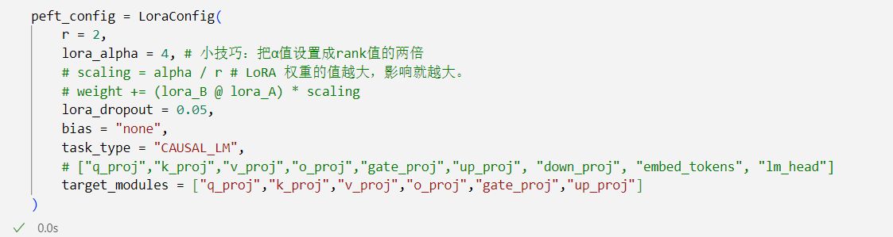
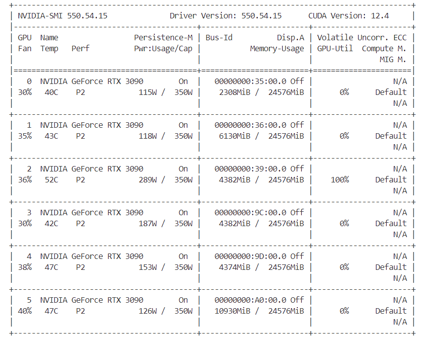
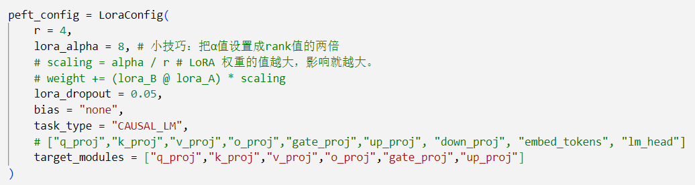
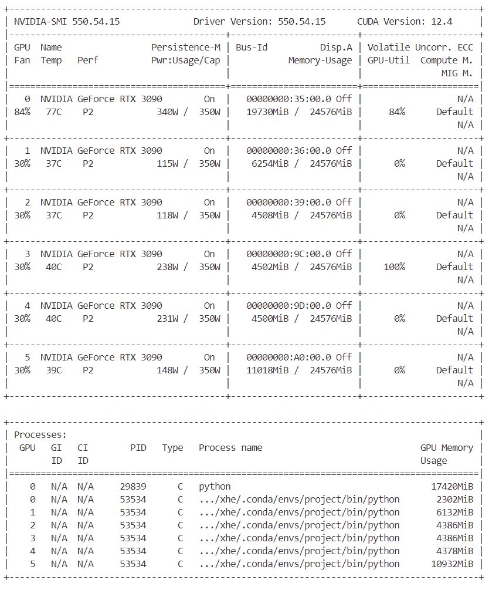
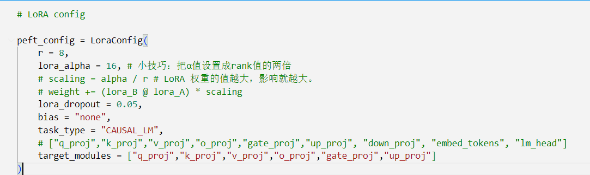
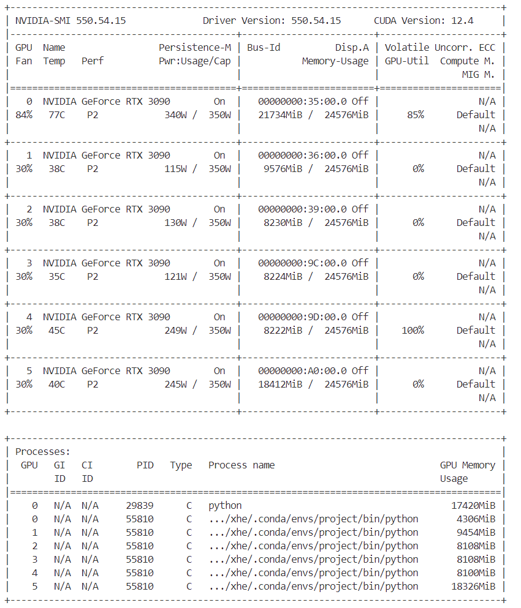
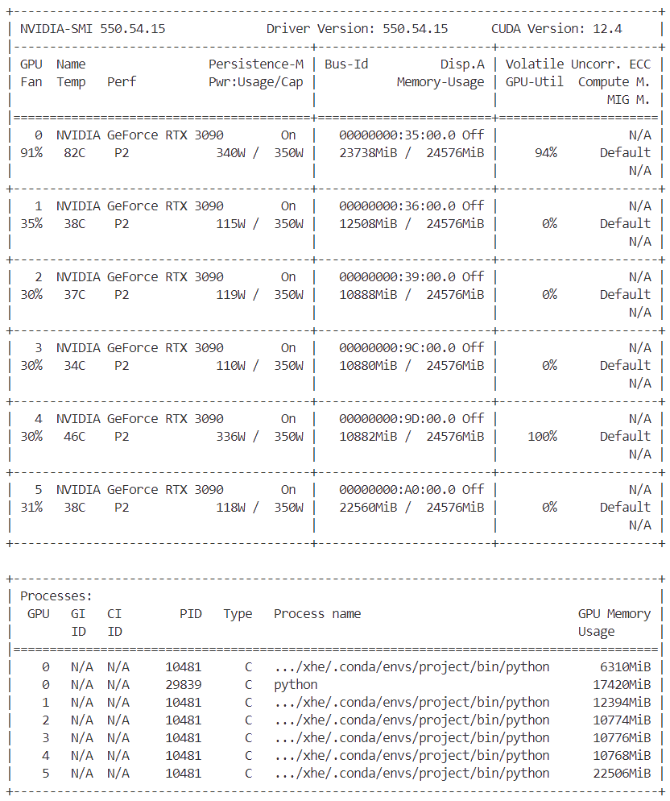
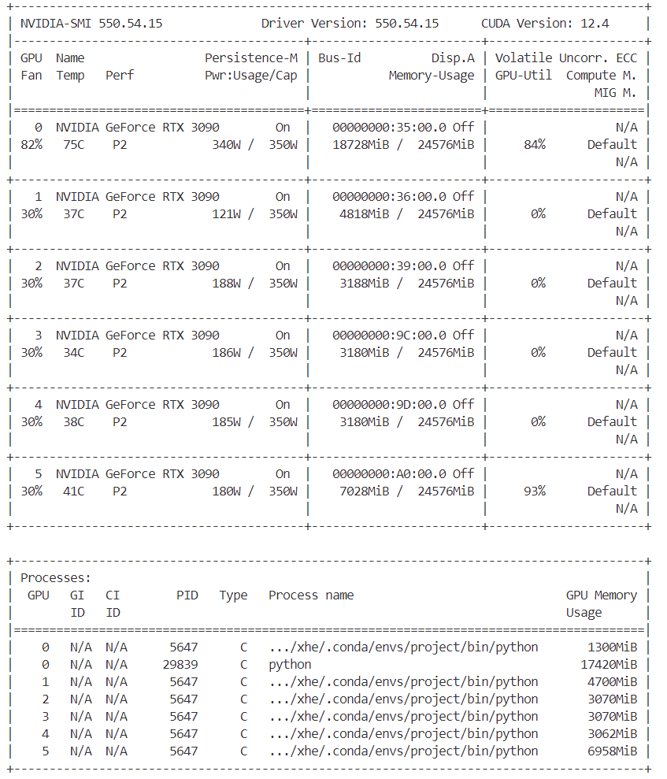

# 推理

如果只是进行推理的话，还是比较容易计算的。

目前模型的参数绝大多数都是`float32`类型, 占用4个字节。所以一个粗略的[计算方法](https://so.csdn.net/so/search?q=计算方法&spm=1001.2101.3001.7020)就是，**每10亿个参数，占用4G显存**(实际应该是`10^9*4/1024/1024/1024=3.725G`，为了方便可以记为4G)。

比如LLaMA的参数量为7000559616，那么全精度加载这个模型参数需要的显存为：

```cobol
7000559616 * 4 /1024/1024/1024 = 26.08G
```

这个数字就有点尴尬，专注游戏的Geforce系列最高只有24G，运行不起来，至少得上[Tesla](https://so.csdn.net/so/search?q=Tesla&spm=1001.2101.3001.7020)系列了。


好在我们可以才用半精度的`FP16/BF16`来加载，这样每个参数只占2个字节，所需显存就降为一半，只需要13.04G。游戏学习两不误。

半精度是个不错的选择，显存少了一半，模型效果因为精度的原因会略微降低，但一般在可接受的范围之内。

如果有个3070显卡，8G显存，还有的玩么？可以玩，采用int8的精度，显存再降一半，仅需6.5G，但是模型效果会更差一些。

我的PC机大概10年前配的，GTX 960 4G，当时最顶配！然而现在只能玩玩int4精度，显存再降一半，仅需3.26G。当年我可是花了千把块买的，虽说只能勉强推理7B的大模型，但是也算是上车了。

目前int4就是最低精度了，再往下效果就很难保证了。比如百川给的量化结果对比如下：


注意上面只是加载模型到显存，模型运算时的一些临时变量也需要申请空间，比如你beam search的时候。所以真正做推理的时候记得留一些Buffer，不然就容易OOM。

如果显存还不够，就只能采用Memery Offload的技术，把部分显存的内容给挪到内存，但是这样会显著降低推理速度。

懒人记法表(粗估，有误差)

| dtype     | 每10亿参数需要占用内存 |
| :-------- | :--------------------- |
| float32   | 4G                     |
| fp16/bf16 | 2G                     |
| int8      | 1G                     |
| int4      | 0.5G                   |

# 训练

模型训练的时候显存使用包括如下几部分：


1. 模型权重，计算方法和上面一样。
2. 优化器。
   - 如果你采用AdamW，每个参数需要占用8个字节，因为需要维护两个状态。也就说优化器使用显存是全精度(float32)模型权重的2倍。
   - 如果采用bitsandbytes优化的AdamW，每个参数需要占用2个字节，也就是全精度(float32)模型权重的一半。
   - 如果采用SGD，则优化器占用显存和全精度模型权重一样。
3. 梯度
   - 梯度占用显存和全精度(float32)模型权重一样。
4. 计算图内部变量(有时候也叫Forward Activations)
   - pytorch/tensorflow等框架采用图结构来计算，图节点在forward和backward的时候需要存储，所以也需要占用显存。

5. 一些临时显存占用，先不计算。

# 多卡

## 数据并行

我的理解就是**空间换时间**

[数据集](https://so.csdn.net/so/search?q=数据集&spm=1001.2101.3001.7020)分为n块，每块随机分配到m个设备(worker)中，相当于m个batch并行训练n/m轮，模型也被**复制**为n块，每块模型均在每块数据上进行训练，各自完成前向和后向的计算得到梯度，对梯度进行更新，更新后，再传回各个worker。以确保每个worker具有相同的模型参数。

## 模型并行

我的理解就是**时间换空间**

由于模型巨大，无法装入单个GPU，此时需要模型并行。

模型并行是包含范围很广的一类技术。它会在多个 worker 之间划分模型的各个层。就其本质而言，模型并行性的计算和通信因模型结构而异，因此在实现上有很大的工作量。DeepSpeed 借用了英伟达的 [Megatron-LM](https://github.com/NVIDIA/Megatron-LM) 来为基于 Transformer 的语言模型提供大规模模型并行功能。模型并行会根据 worker 数量成比例地减少显存使用量，也是这三种并行度中显存效率最高的。但是其代价是计算效率最低。

# 实验

模型选取**Llama3-Chinese-8B-Instruct**

## 情况一

### 参数配置 r=2



### 显存占用




## 情况二

### 参数配置 r=4



### 显存占用



## 情况三

### 参数配置 r=8



### batchsize设为4时（默认）

#### 显存占用


### batchsize设为8时

#### 显存占用



### batchsize设为12时

#### 显存占用




### batchsize设为2时

#### 显存占用

